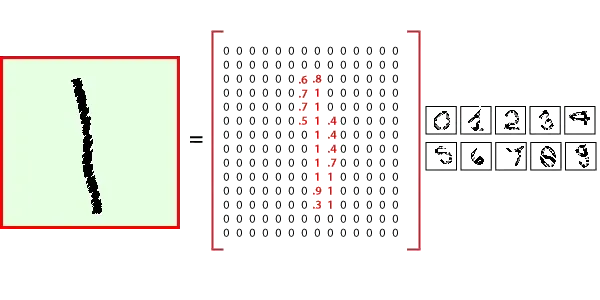
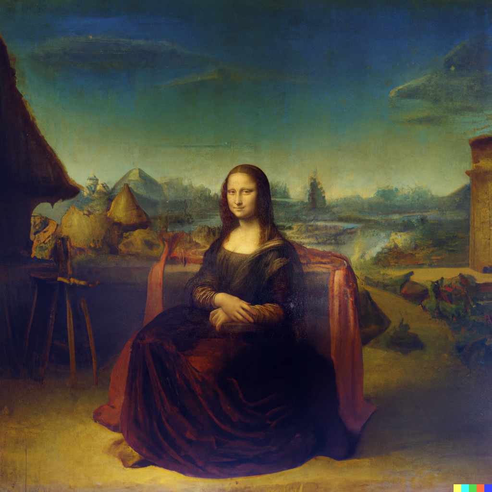
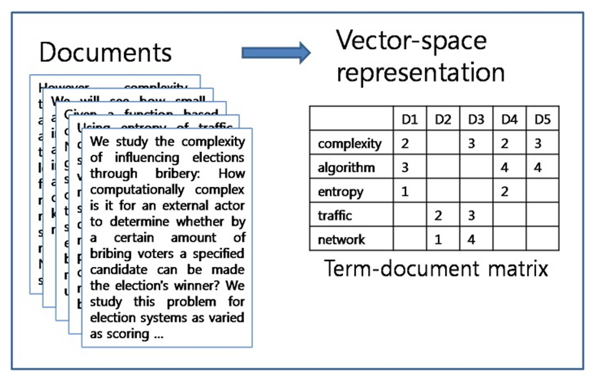
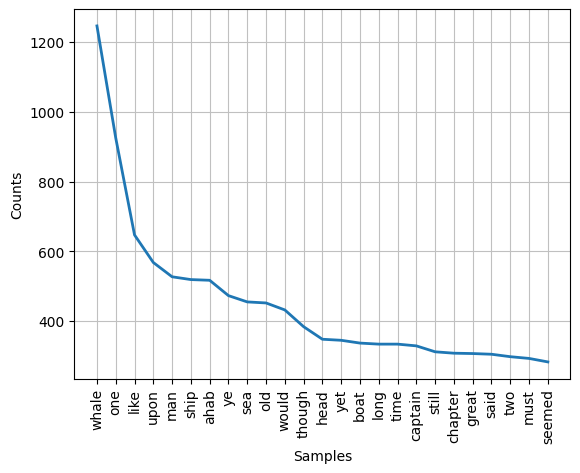
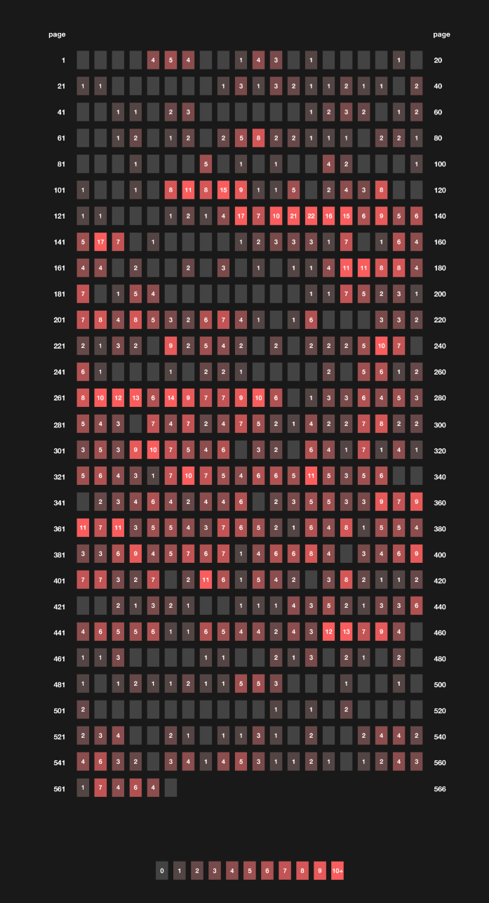
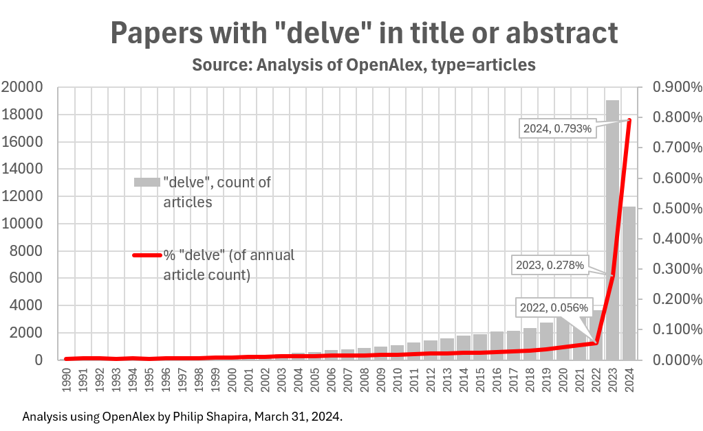
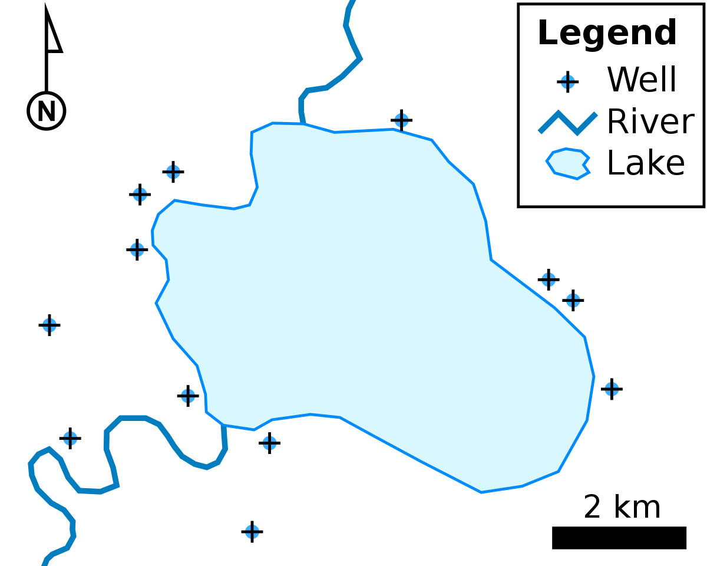
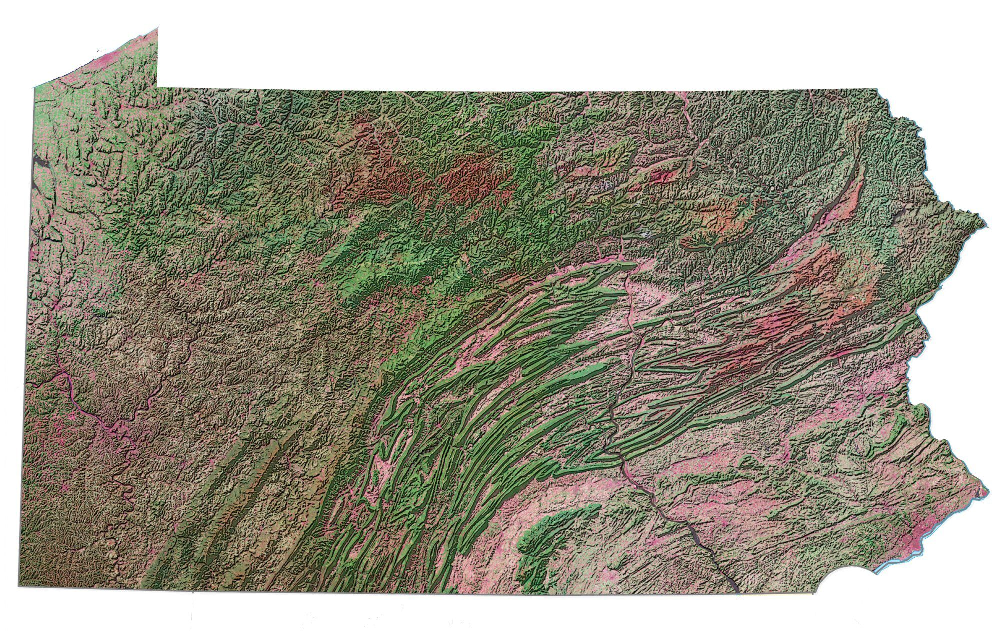
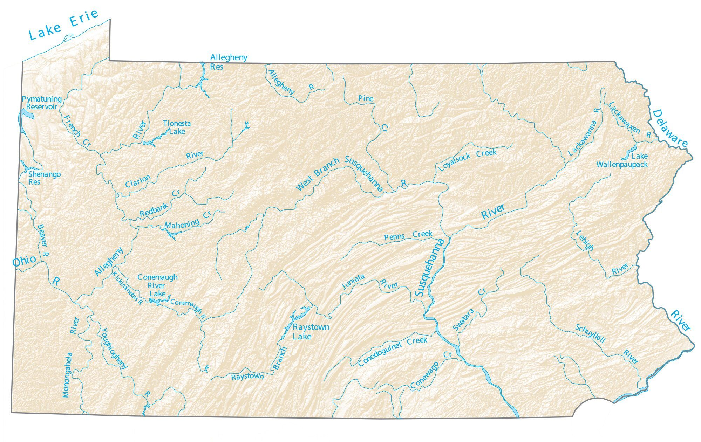
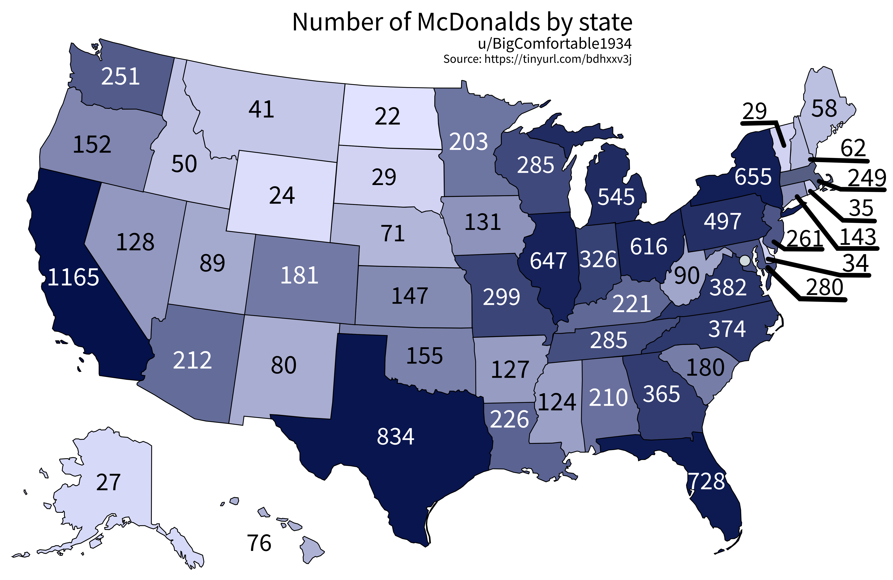

<style>
.caption {
  text-align: center;
  font-size: 14px;
}
</style>


<style>
.word-under { text-decoration: none; }
.def { display: none; }
/* step 2: underline the word */
.remark-slide-content.step2 .word-under { text-decoration: underline; }
/* step 3: keep underline and reveal the definition */
.remark-slide-content.step3 .word-under { text-decoration: underline; }
.remark-slide-content.step3 .def { display: block; }
</style>


<!--
.caption:before {
  content:"Figure: ";
  font-weight: bold;
} -->

```{r setup, include=FALSE}
options(htmltools.dir.version = FALSE)
```

```{r,echo=F}
#library(countdown)
#countdown(minutes = 0, seconds = 10, top = 2,left = 5, right = 5)
```


**Introduction**


<blockquote>What is data science?</blockquote>

&rarr;&nbsp; a field of study that uses scientific methods, processes, and systems to extract knowledge and insights from <span class="word-under">data</span>.

<div class="def"><strong>Data</strong> are a collection of values that convey information, describing the quantity, quality, fact, statistics, other basic units of meaning, or simply sequences of symbols. <em>A datum</em> is an individual value in a collection of data.</div>

--

class: step2

--

class: step3


--


--

$$\\[5cm]$$

Can you think of some examples of data?

--

Census, music (!), images (!), text, maps (!), among many others.
---

<br><br>

**Census**

Every ten years, the U.S. Census Bureau carries out a full count of the population, gathering data on age, race, household structure, and housing.

Why bother? 
--
migration, aging, population growth, family structure...

--

The first census was in 1790 (!) and you can access this information!! [link](https://www.archives.gov/research/census/1790)

--

But a bit earlier than this... the Babylonians are known to have conducted the first ever census in 3,800 BC. 

Who ordered it and why?

--

Among other reasons, crop planning (you don't want your subjects to starve), tax, get a count of your labor force and military power.

What does it look like?: [link](https://www.christies.com/en/lot/lot-5903835)


---

<br><br>

**Music (!)**

What forms of information can a song contain?

What do you think?

--

Length, tempo, key (minor or major), loudness, lyrics (more on that in a sec), instruments. Even fancier: number of notes

--

What can we do with this?

--

Track an artist's career, compare artists, compare eras.. (research)
--
<br>
Music recommendation (🤑💸)
--
<br>
If you are artist: what songs "work?" (in an industrial sense)

[Spotify data](https://www.kaggle.com/datasets/nelgiriyewithana/top-spotify-songs-2023) <br> [An analysis](https://www.kaggle.com/code/alankarmahajan/exploring-spotify-dataset)

---

<br><br>

**Images (!)**

What is an image?

--

A structured collection of pixels arranged in a grid.

```{r,echo=F, out.width="55%",fig.align="center"}

```

--

<div style="margin-top:-20px;">
Text recognition: (🤑💸)

```{r,echo=F, out.width="55%",fig.align="center"}
knitr::include_graphics("mnist2.png")
```
</div>

---

<br><br>

```{r,echo=F, out.width="55%",fig.align="center"}
knitr::include_graphics("monet.jpg")
```

---

<br><br>

```{r,echo=F, out.width="85%",fig.align="center"}
knitr::include_graphics("picasso.png")
```

---

<br><br>

```{r, echo=F, out.width="90%", out.extra='style="margin-left:20px;"'}
knitr::include_graphics("vangoghfake.jpeg")
```


---

<br><br>

 

---


```{r, echo=F, out.width="77%", out.extra='style="margin-left:85px;"'}

```


---

<br> <br>
If you put images together, you get a ... video! Applications:

[Mona Lisa rap](https://www.thestack.technology/mona-lisa-rapping-microsoft-ai-vasa-1/)

[Harry Potter but in Berlin](https://www.youtube.com/watch?v=az7KfOQkMu0&ab_channel=Hoog)

---

<br> <br>
**Text**

&rarr;&nbsp; From a sociolinguistic perspective: any symbolically encoded language.

These come in many types:<br>
Alphabetic – symbols (letters) to represent vowels and consonants (e.g., Latin)<br>
Abjads – symbols to represent consonants, with diacritics to represent vowels (e.g., Arabic, Hebrew) <br>
Syllabic – Symbol systems representing consonants plus inherent vowels (e.g., Devanagari) <br>
Semanto-phonetic – Symbols that carry meaning and/or sounds (e.g., Chinese)

```{r,echo=F, out.width="45%",fig.align="center"}

```


---

<br> <br>
**Text**

Applications: Suppose you load the book Moby-Dick into your computer.

&rarr;&nbsp;an 1851 epic novel by American writer Herman Melville

What can you do with it?


--

<div style="width:300px;">
Word count, most frequent words, sentence length, vocabulary richness, topic modeling, sentiment analysis, character analysis, network graphs, timelines.
</div>


---

<br> <br>

```{r,echo=F, out.width="75%",fig.align="center"}

```

[An interactive version](https://roadtolarissa.com/whalewords)

---

```{r,echo=F, out.width="43%",fig.cap='Number of times the word "whale" appears on every page in Moby Dick', fig.align="center"}

```

---

<br> <br>
**Text**

More applications: authorship classification, spam filter (🤑💸)

<br>
<div style="display:flex; align-items:flex-start;">
  <figure style="width:45%; margin-right:10px;">
    
    <figcaption style="text-align:center; font-size:14px; margin-top:6px;">
      Voynich manuscript
    </figcaption>
  </figure>

  <figure style="width:50%; position:relative; top:20px;">
    
    <figcaption style="text-align:center; font-size:14px; margin-top:6px;">
      Spam detection
    </figcaption>
  </figure>
</div>


---

<br><br>

```{r,echo=F, out.width="80%",fig.align="center"}

```

---

<br> <br>
**Maps (!)**

&rarr;&nbsp; contain information on where borders are, geographical information, demographic information.. among others. <br><br>

```{r,echo=F, out.width="60%",fig.align="center"}

```

---

<br><br>

```{r,echo=F, out.width="90%",fig.align="center"}

```

---

<br><br>

```{r,echo=F, out.width="90%",fig.align="center"}

```

---

<br><br>

```{r,echo=F, out.width="90%",fig.align="center"}
knitr::include_graphics("pa3.png")
```

--

[Interactive map: PA house of representative districts](https://www.redistricting.state.pa.us/Maps)


---

<br><br>

```{r,echo=F, out.width="90%",fig.align="center"}

```

--

[Interactive map: All McDonalds locations in the U.S.](https://www.arcgis.com/home/item.html?id=2a6d0ecb7e5645afb49d8f38a2d2b87b)


---


<br><br><br>

```{r,echo=F, out.width="55%",fig.align="center"}
knitr::include_graphics("thinking.png")
```

<div style="text-align: center;">
Questions..?

<br><br>


</div>


