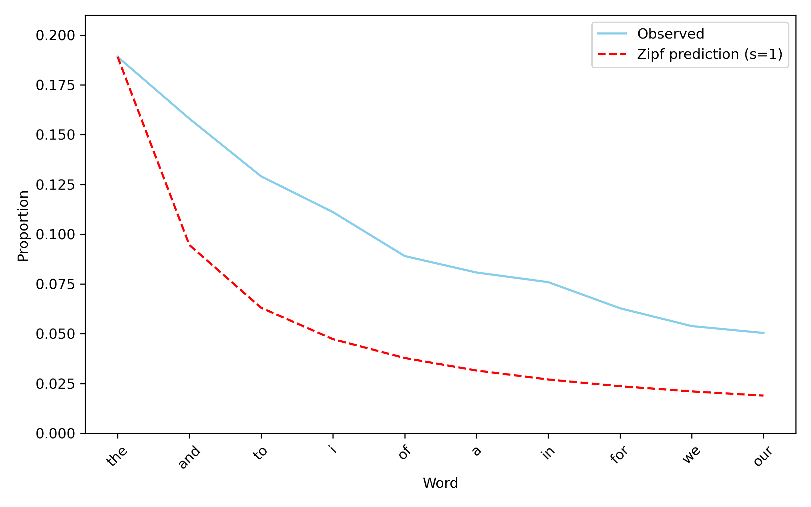

```{r setup, include=FALSE}
options(htmltools.dir.version = FALSE)
knitr::opts_chunk$set(warning = FALSE, message = FALSE)
Sys.setenv(PYTHONWARNINGS = "ignore")
library(reticulate)

# point reticulate to the exact Python you want
#py <- "/Users/eren/anaconda3/envs/r-reticulate/bin/python"
#Sys.setenv(RETICULATE_PYTHON = py)
#use_python(py, required = TRUE)

# make knitr use the same Python for python-engine chunks
#knitr::opts_chunk$set(engine.path = list(python = py))

#use_python("C:/Users/Eren/AppData/Local/r-miniconda/envs/r-reticulate/python.exe", required = TRUE)

# install once if needed (safe if already installed)
try(py_install(c("pandas", "matplotlib", "nltk"), pip = TRUE), silent = TRUE)

#py_config()   # sanity check in knit log

#reticulate::py_install("opencv-python", pip = TRUE)
#reticulate::py_install("scikit-learn", pip = TRUE)
#reticulate::py_install("nltk", pip = TRUE)
```


# Words, words words...

- How many words are there in English?
- How many does an average native speaker know? Use?


---
count: false

# Words, words words...

- How many words are there in English? <br> <span style="color:blue;">About 54,000 per Webster Dictionary</span>
- How many does an average native speaker know? Use? <br> <span style="color:blue;">Roughly 20,000</span>

--

Language changes:

- Language is a dynamic system reflecting culture, technology, and social values.
- Words emerge, shift meaning, or disappear as societies evolve.
- Examples:
  - "Gay" once meant "joyful," now refers primarily to sexual orientation.
  - "Swipe" gained a new digital meaning through smartphones.
  - "Thou" disappeared as pronouns simplified in Modern English.

--

We can check frequencies over time across many books: https://books.google.com/ngrams/?utm_source=chatgpt.com


---

# Zipf's Law

- A strange but very robust phenomenon where frequency of each word is equally proportional to its rank.

- Eg, The second most common word appears 1/2 times the top; the third occurs 1/3 etc.

https://www.youtube.com/watch?v=fCn8zs912OE

<center>
  
</center>

---


# Beyond frequency: Finding fingerprints

- Every author leaves a measurable statistical "signature."
- Function words (the, and, of, to) vary subtly but <u>consistently.</u>
- Stylometry compares these distributions to identify:
  - authorship disputes (Federalist Papers, Shakespeare)
  - consistency within one writer's works.


Question: Can we identify a text's author using only word frequencies?


---

# Setup

```{python}
import numpy as np
import nltk
import re
from nltk.corpus import gutenberg, stopwords
from collections import Counter

#nltk.download('gutenberg')
#nltk.download('punkt')
#nltk.download('punkt_tab')
#nltk.download('stopwords')
```

```{python book-list}
book_list = ['melville-moby_dick.txt','shakespeare-hamlet.txt',\
             'shakespeare-macbeth.txt','austen-emma.txt','bible-kjv.txt',\
            'bryant-stories.txt','chesterton-brown.txt']
```

```{python stopwords}
stop_words = set(stopwords.words('english'))
```

---

# Top Words Across Books

<div style="font-size:12px; line-height:1.1">
<style>
.slide-specific pre code {
  font-size: 12px !important;
}
</style>

<div class="slide-specific">

```{python top-words,eval=F}
# strategy: loop over book_list, get rid of stopwords, make 
# lowercase, get rid of punctuation, return the top 10 most frequent 
# words in each book
myfilter = ['said','one','upon'] # custom filter

for book in book_list:
    print('Now reading:', book)

    words = gutenberg.words(book) # read the book from gutenberg

    # make everything lowercase, store in tokens list
    tokens = []
    for w in words:
        tokens.append(w.lower())

    # get rid of stopwords and punctuation
    clean_tokens = []
    for w in tokens:
        # only if a word contains non-numeric and non-punctuation 
        # characters and your word is not in the stop_words list, 
        # then your word gets appended to clean_tokens
        if w.isalpha() and w not in stop_words and w not in myfilter:
            clean_tokens.append(w)
            
    freq = Counter(clean_tokens) # get frequencies for each token

    print(freq.most_common(10)) # print the top 10 most common tokens

```

---

# Top Words Across Books

<div style="font-size:12px; line-height:1.1">
<style>
.slide-specific pre code {
  font-size: 12px !important;
}
</style>

<div class="slide-specific">

```{python}
# strategy: loop over book_list, get rid of stopwords, make 
# lowercase, get rid of punctuation, return the top 10 most frequent 
# words in each book
myfilter = ['said','one','upon'] # custom filter

for book in book_list:
    print('Now reading:', book)

    words = gutenberg.words(book) # read the book from gutenberg

    # make everything lowercase, store in tokens list
    tokens = []
    for w in words:
        tokens.append(w.lower())

    # get rid of stopwords and punctuation
    clean_tokens = []
    for w in tokens:
        # only if a word contains non-numeric and non-punctuation 
        # characters and your word is not in the stop_words list, 
        # then your word gets appended to clean_tokens
        if w.isalpha() and w not in stop_words and w not in myfilter:
            clean_tokens.append(w)
            
    freq = Counter(clean_tokens) # get frequencies for each token

    print(freq.most_common(10)) # print the top 10 most common tokens

```

---

# Corpus Size And Sentence Length

<div style="font-size:10px; line-height:1">
<style>
.slide-specific2 pre code {
  font-size: 10px !important;
}
</style>

<div class="slide-specific2">

```{python corpus-stats}
# get total words, number of unique words, avg sentence length
import numpy as np

for book in book_list:
    print('Now reading:', book)
    words = gutenberg.words(book) # read the book from gutenberg

    # make everything lowercase, store in tokens list
    tokens = []
    for w in words:
        tokens.append(w.lower())

    # count non-punctuation characters
    no_punc = []
    for w in tokens:
        if w.isalpha():
            no_punc.append(w)

    # get the avg sentence length:
    raw_text = gutenberg.raw(book)
    try:
        sentences = nltk.sent_tokenize(raw_text)
    except:
        sentences = [s for s in re.split(r'[.!?]+', raw_text) if s.strip()]

    sentence_lengths = []
    for s in sentences:
        sentence_lengths.append(len(s.split()))

    print('Total number of words:', len(no_punc))
    print('Total number of unique words:', len(set(no_punc))) # set() gets rid of duplicates
    print('Avg sentence length:', np.round(np.mean(sentence_lengths),2))

    # get rid of stopwords and punctuation
    clean_tokens = []
    for w in tokens:
        # same as before
        if w.isalpha() and w not in stop_words:
            clean_tokens.append(w)
```

---

# Inspecting Moby-Dick

```{python load-moby}
book = gutenberg.words('melville-moby_dick.txt')
book
```

```{python total-moby}
len(gutenberg.words('melville-moby_dick.txt'))
```

```{python unique-example}
len(set(['book','paper','plane','book']))
```

```{python crazy-check}
'crazy' in book
```

---

# Clean Tokens

```{python clean-moby-tokens}
tokens = []
for w in book:
    tokens.append(w.lower())

clean_tokens = []
for w in tokens:
    # as before
    if w.isalpha() and w not in stop_words:
        clean_tokens.append(w)
```

---

# Where Does "crazy" Appear?

```{python crazy-positions}
for i in range(len(clean_tokens)):
    if clean_tokens[i] == 'crazy':
        print('Found at position: ', i)
```

---

# Context Windows

<div style="font-size:12px; line-height:1.1">
<style>
.slide-specific3 pre code {
  font-size: 12px !important;
}
</style>

<div class="slide-specific3">

```{python crazy-context}
target = 'crazy' # target word
window = 5 # plus-minus 5 words around the word 'crazy'

# get rid of punctuation
words = []
for w in book:
    if w.isalpha():
        words.append(w)

for i in range(len(words)):
    if words[i] == target:
        start = max(0, i - window) # ensures that you never go to negative index
        end = min(len(words),i + window) # never go above the total number of words in the book
        context = words[start:end+1]
        print('Context: ', context)
```

---

# Co-occurrence Counts

<div style="font-size:12px; line-height:1.1">
<style>
.slide-specific3 pre code {
  font-size: 12px !important;
}
</style>

<div class="slide-specific3">

```{python crazy-cooccurrence}
target = 'crazy'
partner_words=['man','sea', 'Ahab']
window = 5

# create two counters, one for each partner_words
# loop over partner_words list
counts = {} # dictionary
for partner in partner_words:
    counts[partner] = 0 # set counts to 0 initially

# same as before
for i in range(len(words)):
    if words[i] == target:
        start = max(0, i - window) # ensures that you never negative index
        end = min(len(words),i + window) # ensures that you never go above the total number of words in the book
        context = words[start:end+1]

        # check if within each context, a partner word appears:
        for partner in partner_words:
            if partner in context:
                counts[partner] = counts[partner] + 1 # if so, increase the count by 1

print('Co-occurance counts for target word:', target)
print(counts)
```

---

# Co-occurrence Matrix

<div style="font-size:10px; line-height:1.1">
<style>
.slide-specific4 pre code {
  font-size: 10px !important;
}
</style>

<div class="slide-specific4">

```{python cooccurrence-matrix}
book = 'melville-moby_dick.txt'
focus_words = ['whale','man','ship','ahab','sea','old','white','death','captain','god']
window = 5

# Make an empty table of zeros
n = len(focus_words) # this should be 10 zeros
table = np.zeros((n,n)) # creates a 10 by 10 zeros which will be updated later

# read the book
words = gutenberg.words(book)

# make everything lowercase, store in tokens list
tokens = []
for w in words:
    tokens.append(w.lower())

clean_tokens = []
for w in tokens:
    if w.isalpha() and w not in stop_words:
        clean_tokens.append(w)

# big loop where we count co-occurances:
for i in range(len(clean_tokens)):
    if clean_tokens[i] in focus_words: # note that each word in focus_words is a target word now
        target = clean_tokens[i]
        start = max(0, i - window) # ensures that you never go negative index
        end = min(len(clean_tokens),i + window+1) # never go above the total number of words
        context = clean_tokens[start:end] # get the context
        #print(context)
        
        row = focus_words.index(target) # this gets the row position of the target word
        for word in context:
            if word in focus_words and word != target: # latter for not counting target itself
                col = focus_words.index(word)
                table[row, col] += 1
                
print(table)
```

---

# Convert to pandas dataframe

```{python}
import pandas as pd

df = pd.DataFrame(table, index=focus_words, columns=focus_words)
df = df.astype(int)
df
```

---

# Heatmap Viz

<div style="font-size:16px; line-height:1.25">
<style>
.slide-specific5 pre code {
  font-size: 16px !important;
}
</style>

<div class="slide-specific5">

```{python, dpi=300, fig.retina=2}
import matplotlib.pyplot as plt
import seaborn as sns

plt.figure(figsize=(6,4))
sns.heatmap(df, annot=True, fmt='d', cmap='Blues') # d for integer
plt.tight_layout()
plt.show()
```


