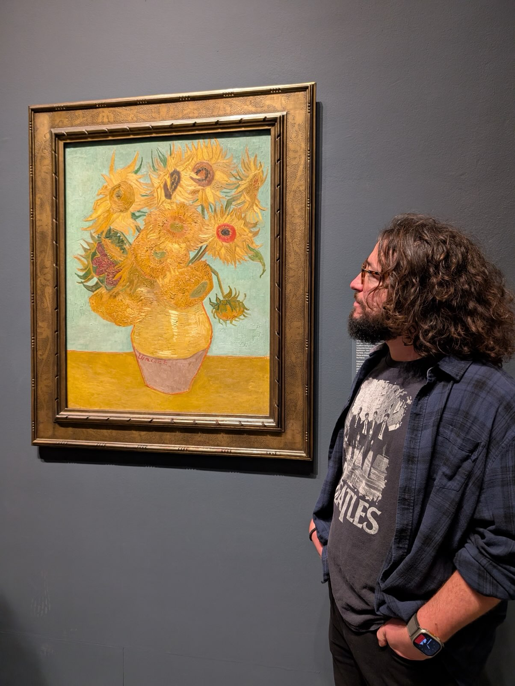
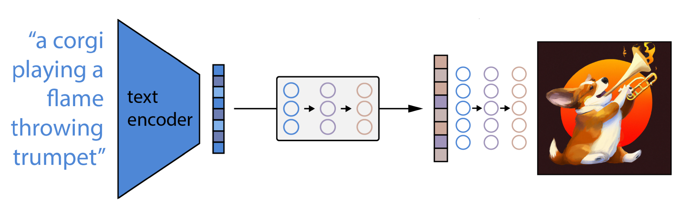

```{r setup, include=FALSE}
options(htmltools.dir.version = FALSE)
library(reticulate)

# point reticulate to the exact Python you want
#py <- "/Users/eren/anaconda3/envs/r-reticulate/bin/python"
#Sys.setenv(RETICULATE_PYTHON = py)
#use_python(py, required = TRUE)

# make knitr use the same Python for python-engine chunks
#knitr::opts_chunk$set(engine.path = list(python = py))

#use_python("C:/Users/Eren/AppData/Local/r-miniconda/envs/r-reticulate/python.exe", required = TRUE)

# install once if needed (safe if already installed)
#try(py_install(c("pandas", "matplotlib", "sklearn", 'opencv-python'), pip = TRUE), silent = TRUE)

#py_config()   # sanity check in knit log

#reticulate::py_install("opencv-python", pip = TRUE)
#reticulate::py_install("scikit-learn", pip = TRUE)
```


# What is an image?

- A digital image is a grid of numbers.
- Each pixel stores color information.

- In computer vision we usually store color in RGB channels:

R: red <br>
G: green <br>
B: blue <br>
  
- Can you guess what these colors are? <br><br>
--

  RGB = (255, 0, 0)
--
<span style="color: red;"> red</span> <br>
--
  RGB = (0, 255, 0) 
--
<span style="color: green;">green</span> <br>
  
--
  RGB = (128, 0, 128) 
--
<span style="color: purple;">purple</span>

--

- A 1200 by 800 image has 960,000 pixels.

- Each pixel is a simple dot, but together they form meaningful structure.

We can analyze images with math and statistics!

---

# How does the computer see an image?

<div style="font-size:10px; line-height:1">
<style>
.slide-specific pre code {
  font-size: 16px !important;
}
</style>

<div class="slide-specific">

<div style="margin-top:-10px; margin-bottom:-10px">

```{python,results="hide"}
import cv2
import matplotlib.pyplot as plt

img = cv2.imread("monalisa.jpg")
img = cv2.cvtColor(img, cv2.COLOR_BGR2RGB) # convert colors to rgb

plt.figure(figsize=(6,4))
plt.imshow(img)
plt.axis("off")
```
  
---

- Every square you see in the image is a single pixel.
- Each has three values between 0 and 255.

```{python,results="hide"}
small = img[300:350, 200:250] # crop tiny patch
plt.figure(figsize=(2,2))
plt.imshow(small)
plt.title("A small pixel region")
plt.axis("off")
```

```{python}
small.shape
```

---

# Image data is quantifiable

- Data science can quantify many visual ideas.
- Examples:
  - What colors are dominant?
  - How bright is the image?
  - Where are the edges?
  - What objects are present?
  - Can we compare two images mathematically?
  
This is exactly how apps like Google Photos, Pinterest, and face detection systems work.

---

```{python}
colors = ("red", "green", "blue")
plt.figure(figsize=(6,4))
for i, col in enumerate(colors):
    hist = cv2.calcHist([img], [i], None, [256], [0,256])
    plt.plot(hist, color=col, label=col)
plt.title("Color distribution")
plt.xlabel("pixel intensity (dark bright)")
plt.legend()
plt.show()
```

---

```{python,results="hide"}
# Finding dominant colors using k-means clustering
from sklearn.cluster import KMeans
import numpy as np
import matplotlib.pyplot as plt

pixels = img.reshape(-1, 3) # flatten to a vector

kmeans = KMeans(n_clusters=5).fit(pixels)
colors = kmeans.cluster_centers_.astype(int)

plt.figure(figsize=(6,1))
plt.imshow([colors])
plt.axis("off")
```

---

```{python}
flip = cv2.flip(img, 1)

plt.figure(figsize=(10,4))
plt.subplot(1,2,1); plt.imshow(img); plt.axis("off"); plt.title("Original")
plt.subplot(1,2,2); plt.imshow(flip); plt.axis("off"); plt.title("Mirror flipped")
plt.show()
```

---

```{python}
gray = cv2.cvtColor(img, cv2.COLOR_RGB2GRAY)
plt.figure(figsize=(5,4));
plt.hist(gray.ravel(), bins=30, color="gray")
plt.title("Brightness distribution")
plt.xlabel("dark to bright")
```

---

# How about Van Gogh?

<div style="text-align:center;">
  
  <div style="font-size:14px; color:#555; margin-top:6px;">
    Me at Philadelphia Museum of Arts, December 7, 2025
  </div>
</div>
---

# How about Van Gogh?

<div style="font-size:10px; line-height:1">
<style>
.slide-specific pre code {
  font-size: 16px !important;
}
</style>

<div class="slide-specific">

<div style="margin-top:-10px; margin-bottom:-10px">

```{python,results="hide"}
import cv2
import matplotlib.pyplot as plt

img = cv2.imread("vangogh.jpg")
img = cv2.cvtColor(img, cv2.COLOR_BGR2RGB) # convert colors to rgb

plt.figure(figsize=(6,4))
plt.imshow(img)
plt.axis("off")
```

---

```{python}
colors = ("red", "green", "blue")
plt.figure(figsize=(6,4))
for i, col in enumerate(colors):
    hist = cv2.calcHist([img], [i], None, [256], [0,256])
    plt.plot(hist, color=col, label=col)
plt.title("Color distribution")
plt.xlabel("pixel intensity (dark bright)")
plt.legend()
plt.show()
```

---

```{python,results="hide"}
# Finding dominant colors using k-means clustering
from sklearn.cluster import KMeans
import numpy as np
import matplotlib.pyplot as plt

pixels = img.reshape(-1, 3) # flatten to a vector

kmeans = KMeans(n_clusters=5).fit(pixels)
colors = kmeans.cluster_centers_.astype(int)

plt.figure(figsize=(6,1))
plt.imshow([colors])
plt.axis("off")
```

---

```{python}
gray = cv2.cvtColor(img, cv2.COLOR_RGB2GRAY)
plt.figure(figsize=(5,4))
plt.hist(gray.ravel(), bins=30, color="gray");
plt.title("Brightness distribution")
plt.xlabel("dark to bright")
```

---

```{python}
flip = cv2.flip(img, 1)

plt.figure(figsize=(10,4))
plt.subplot(1,2,1); plt.imshow(img); plt.axis("off"); plt.title("Original")
plt.subplot(1,2,2); plt.imshow(flip); plt.axis("off"); plt.title("Mirror flipped")
plt.show()
```

---

# An application: Average pixel colors from hand drawn images

https://www.reddit.com/r/dataisbeautiful/comments/1mtm9qd/oc_average_of_256_handdrawn_copies_of_the_mona

---

# Movies and color

https://www.reddit.com/r/Letterboxd/comments/1idw546/what_are_some_of_your_favorite_color_palettes_in/

https://www.reddit.com/r/dataisbeautiful/comments/fhbq1a/oc_timelines_of_average_color_of_frames_of_2020

https://www.reddit.com/r/dataisbeautiful/comments/f773m1/oc_visualization_of_the_colour_palette_or_barcode

---

# AI art

- If you have large database of images, you can train a model that produces "new" images that you want. Eg., Dall-E, Midjourney...
- Eg, 



- Very controversial. Did artists consent to be included in the training set?

---

# Ideas

- Clustering paintings or eras by similarity.
- Authentication of disputed paintings through texture and color signatures.
- Restoring or identifying old restorations using edge and brightness changes.
- Studying how color palettes shift from early Renaissance to late Renaissance to Impressionism to Modernism.


