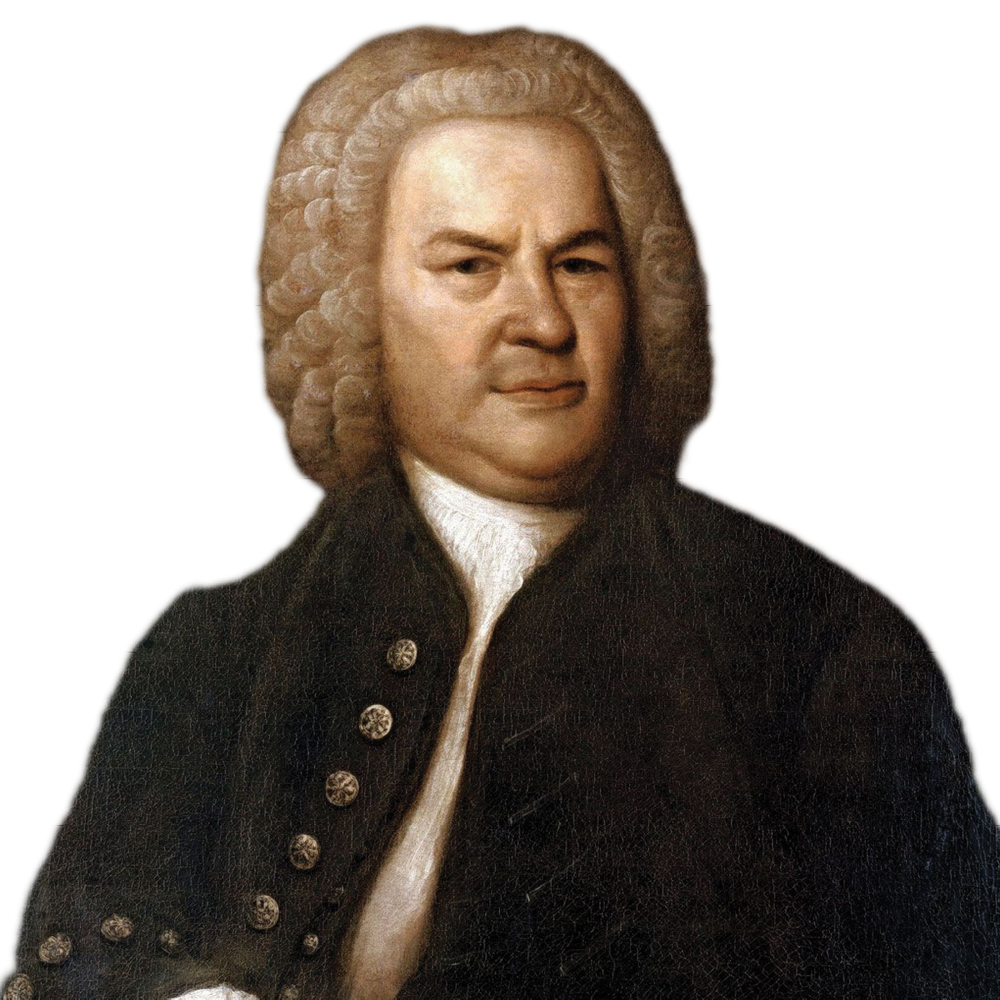

<style>
.caption {
  text-align: center;
  font-size: 14px;
}
</style>


<style>
.word-under { text-decoration: none; }
.def { display: none; }
/* step 2: underline the word */
.remark-slide-content.step2 .word-under { text-decoration: underline; }
/* step 3: keep underline and reveal the definition */
.remark-slide-content.step3 .word-under { text-decoration: underline; }
.remark-slide-content.step3 .def { display: block; }
</style>


<!--
.caption:before {
  content:"Figure: ";
  font-weight: bold;
} -->

```{r setup, include=FALSE}
options(htmltools.dir.version = FALSE)
library(reticulate)

# point reticulate to the exact Python you want
py <- "/Users/eren/anaconda3/envs/r-reticulate/bin/python"
Sys.setenv(RETICULATE_PYTHON = py)
use_python(py, required = TRUE)

# make knitr use the same Python for python-engine chunks
knitr::opts_chunk$set(engine.path = list(python = py))

# install once if needed (safe if already installed)
try(py_install(c("pandas", "matplotlib", "seaborn"), pip = TRUE), silent = TRUE)

py_config()   # sanity check in knit log
```

```{r,echo=F}
#library(countdown)
#countdown(minutes = 0, seconds = 10, top = 2,left = 5, right = 5)
```

<br><br>
**Where do data come from?**


--

$$\\[1cm]$$
&rarr;&nbsp; from **a unit** or **object** is an item we observe. When the unit is a person, we call the unit as a **subject**. (cars, plants, Dickinson students..)

--

&rarr;&nbsp; the information we record is called an **observation**. (Like, age)

--

&rarr;&nbsp; if we record all observations and store it together, we have a **variable**. (Like, age can vary from person to person)

--

&rarr;&nbsp; if we put bunch of variables together, we have a **dataset**. Data sets look like tables or spreadsheets.

--

&rarr;&nbsp; if we put bunch of data sets together, we have a **database**. (we won't work with databases in this class, but know that most companies and organizations work databases because of how much data they have)


---

<br><br>
**Where do data come from?**


--

$$\\[1cm]$$

How to go about collecting data? If you collect it from the entire population, ie, every object or member of the group: **census**. (super costly)

--

&rarr;&nbsp; Luckily we don't need to, due to the Central Limit Theorem (CLT).

--

CLT says: if you collect data from a random subset from the population, the implications you can derive from your sample will be roughly the same as if you access to the entire population! (getting a sample is easier, but not a walk in the park either, eg: political polls)

--

```{r,echo=F, out.width="48%",fig.align="right"}

```

---
<br><br>
**Variable Types**

→ **Categorical (qualitative)** variables are those which classify the units into categories. The categories may or may not have a natural ordering to them.

Example: Education level (high-school, college,…)

→ A **numeric (quantitative)** variable is one that measures a numerical characteristic.

Example: Years of education, income

--

What do you think?: eye color
--
, number of words in a book
--
, hometown
--
, zipcode

--

Precision of recording:<br>
A **discrete variable** can only consist of integer values, 
	e.g., N = {1, 2, 3, …}
	
A **continuous variable** can take on any value within a given interval. e.g., 1.5088039, 5, 693.84975 …

--

What do you think? Number of elevators in a building
--
, IMDB score
--
, duration of a speech

---


<br><br>
**Activity:**

→ Suppose you are studying Shakespeare plays. You want to collect data to answer some research questions.

Come up with **three variables** you could record.

-How you would measure it (be specific).<br>
-Identify whether it is numerical, categorical.<br>
-If numerical, is it discrete or continuous?<br>
-Note any possible measurement issues.

```{r,echo=F, out.width="48%",out.extra='style="margin-top:-150px;margin-left:400px;"'}
knitr::include_graphics("shakespeare.png")
```


---

<br><br>
**Activity:**

→ Let's repeat the previous activity, but this time with Johann Sebastian Bach's works.

Come up with **three variables** you could record.

-How you would measure it (be specific).<br>
-Identify whether it is numerical, categorical.<br>
-If numerical, is it discrete or continuous?<br>
-Note any possible measurement issues.

```{r,echo=F, out.width="48%",out.extra='style="margin-top:-150px;margin-left:400px;"'}

```

---

<br><br>

**Dataframes**

In python and R, datasets are often representated as **dataframes**. Dataframes are objects in your programming session that hold your dataset in a table-like form.

Examples:

[Titanic data](https://www.kaggle.com/datasets/aliaamiri/titanic-passengers-and-crew-complete-list?utm_source=chatgpt.com) ([dashboard](https://reporttitanic.streamlit.app))

[Enrollment dashboard at Dickinson](https://enrollment.streamlit.app)

---

<br><br>

**Statistical summaries from data**

Measures of Central Tendency <br>
-Mean: Arithmetic average, $\bar{x} = \frac{\sum_{i=1}^{n} x_i}{n}$ Sensitive to extremes ⚠️<br>
-Median: Middle value when sorted. Robust against outliers.<br>
-Mode: Most frequent value. Useful for categorical data.<br>

```{r,echo=F, out.width="60%",out.extra='style="margin-top:10px;margin-left:-20px;"'}
knitr::include_graphics("titanicage.png")
```

```{r, echo=F, out.width="45%", out.extra='style="position:relative; top:-400px; left:450px; z-index:10;"'}
knitr::include_graphics("meanmedian.png")
```


---

<br><br>

**Activity**

Suppose we want to know about class sizes at Dickinson. We sampled 7 classes:

| Course    | Enrollment | Subject       |
|-----------|------------|---------------|
| DATA 101  | 11         | Data Analytics|
| MATH 225  | 24         | Math          |
| HIST 206  | 7          | History       |
| INBM 236  | 25         | Business      |
| ECON 101  | 24         | Economics     |
| ECON 214  | 18         | Economics     |
| ECON 351  | 24         | Economics     |

<br>
-Find mean and median of `Enrollment`.<br>
-Find the mode of `Subject`.


---

<br><br>

**Statistical summaries from data**

Measures of Spread (Variability) <br>
-Range = Max - Min. Very sensitive to extremes. ⚠️<br>
-Variance: Average squared deviation from the mean.<br>
-Standard Deviation (SD): Square root of variance; to get back the original units.

<div style="display:flex; align-items:center; gap:24px;">

  <!-- make the image column take ~70% of the slide -->
  <div style="flex:0 0 70%;">
    
  </div>

<div style="flex:0 0 30%; font-size:110%; margin-top:-100px;">
  
sample variance:
$$
s^2 = \frac{\sum_{i=1}^{n} (x_i - \bar{x})^2}{n-1}
$$

sample std dev:
$$
s = \sqrt{\frac{\sum_{i=1}^{n} (x_i - \bar{x})^2}{n-1}}
$$
</div>

</div>


---

<br><br>

**Activity**

Suppose we want to know about class sizes at Dickinson. We sampled 7 classes:

| Course    | Enrollment | Subject       |
|-----------|------------|---------------|
| DATA 101  | 11         | Data Analytics|
| MATH 225  | 24         | Math          |
| HIST 206  | 7          | History       |
| INBM 236  | 25         | Business      |
| ECON 101  | 24         | Economics     |
| ECON 214  | 18         | Economics     |
| ECON 351  | 24         | Economics     |

<br>
-Find the standard deviation of `Enrollment`.<br>

---

<br><br>

**Fun one:** 


| Library                         | Floors | Type       |
|---------------------------------|--------|------------|
| Bodleian Library (Oxford)       | 2      | Academic   |
| British Library (London)        | 2      | National   |
| Library of Alexandria (Egypt)   | 2      | Public     |
| Vatican Library (Rome)          | 2      | Religious  |
| Beinecke Library (Yale)         | 2      | Academic   |
| Trinity College Library (Dublin)| 2      | Academic   |
| Library of Congress (D.C.)      | 2      | National   |

<br>
-Find the mean and standard deviation of `Floors`.<br>

---


<br><br><br>

```{r,echo=F, out.width="55%",fig.align="center"}
knitr::include_graphics("thinking.png")
```

<div style="text-align: center;">
Questions..?

<br><br>


</div>


