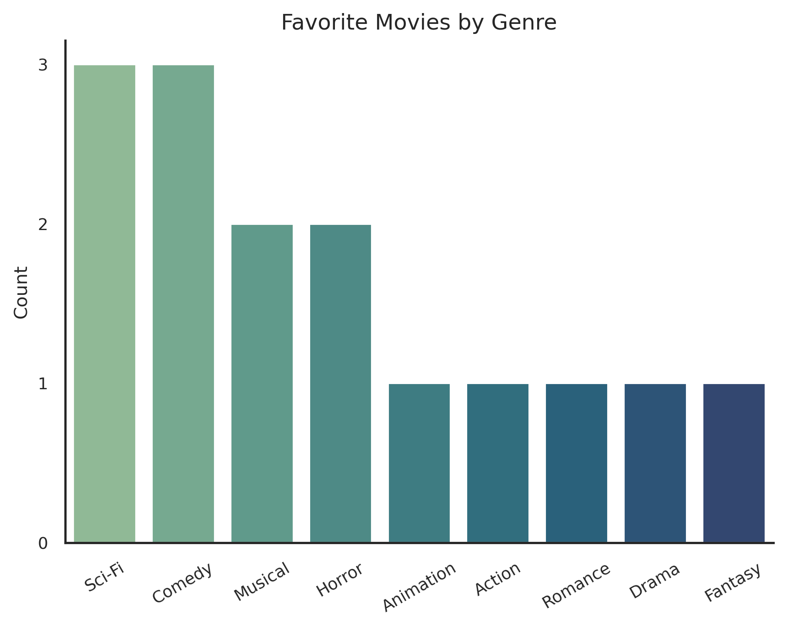
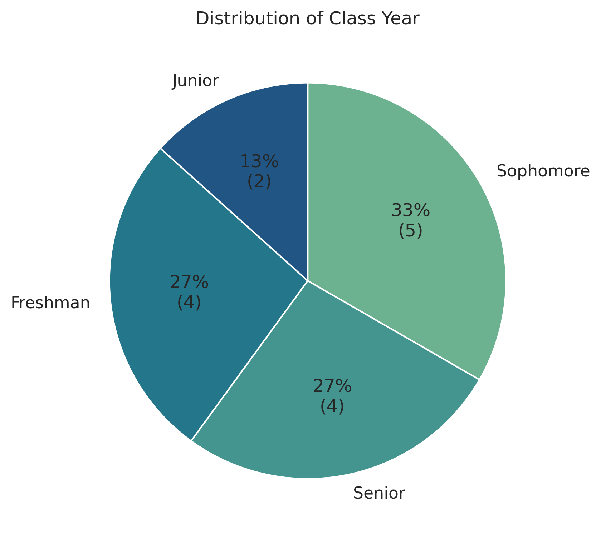
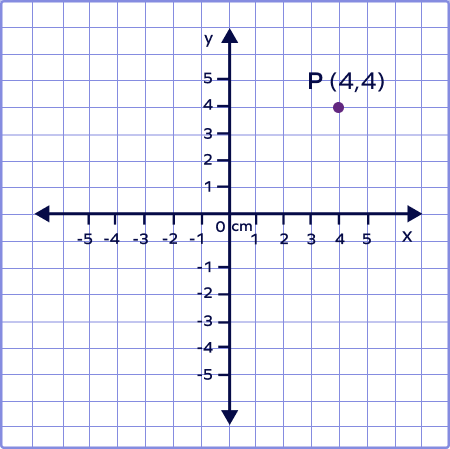
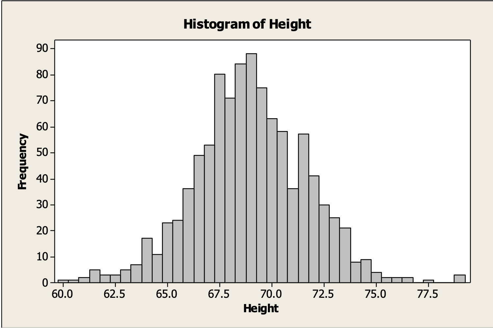
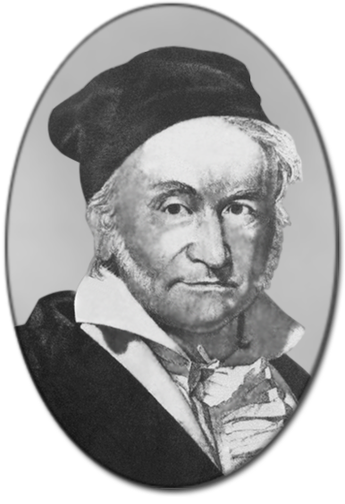
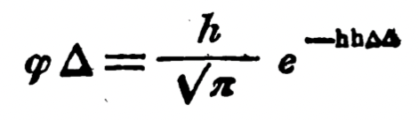
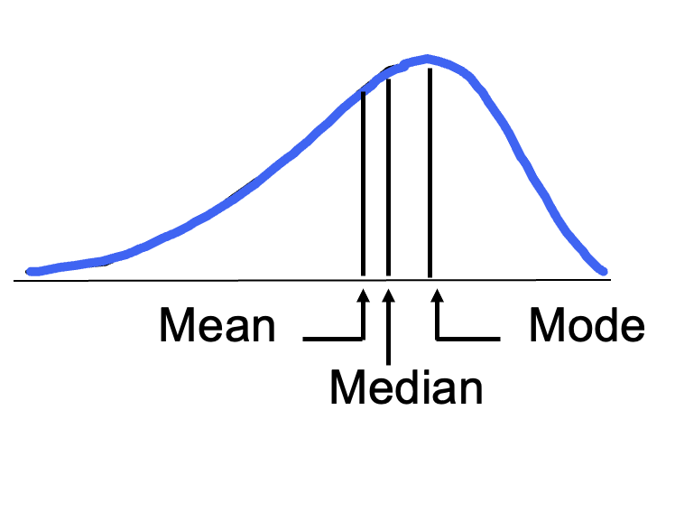
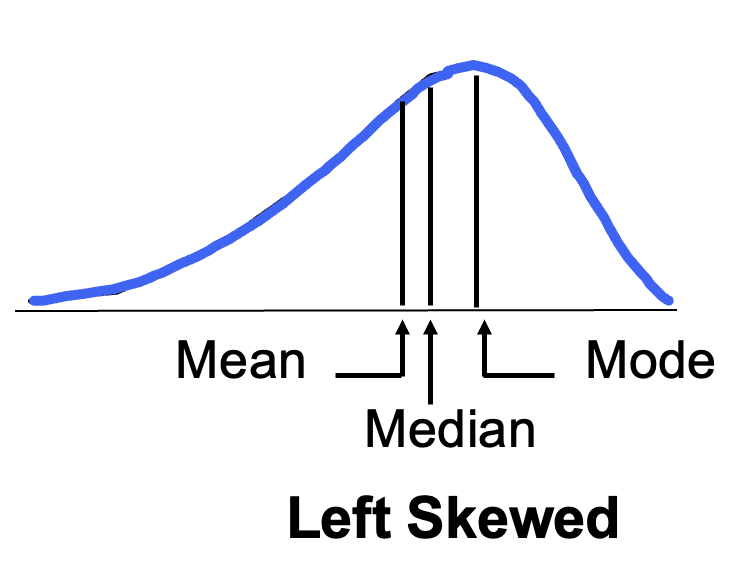
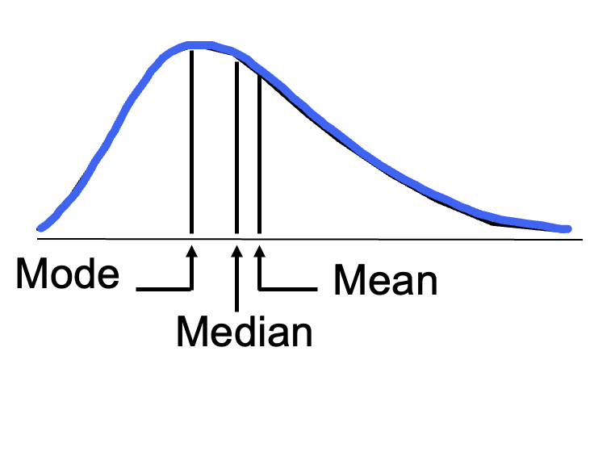
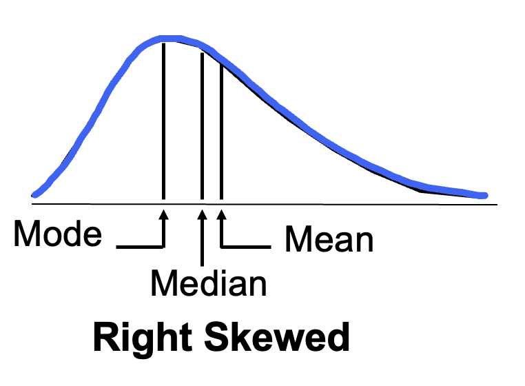

<style>
.title-slide::after {
  content: "* I recommend taking Data 201: Visualization if you can. Data 101 counts as its prerequisite.";
  position: absolute;
  bottom: 100px;
  left: 50%;
  transform: translateX(-50%);
  font-size: 20px;
  color: white;
}
</style>


<style>
.caption {
  text-align: center;
  font-size: 14px;
}
</style>


<style>
.word-under { text-decoration: none; }
.def { display: none; }
/* step 2: underline the word */
.remark-slide-content.step2 .word-under { text-decoration: underline; }
/* step 3: keep underline and reveal the definition */
.remark-slide-content.step3 .word-under { text-decoration: underline; }
.remark-slide-content.step3 .def { display: block; }
</style>


<!--
.caption:before {
  content:"Figure: ";
  font-weight: bold;
} -->

```{r setup, include=FALSE}
options(htmltools.dir.version = FALSE)
# suppress *Python* warnings before Python starts
Sys.setenv(PYTHONWARNINGS = "ignore")
library(reticulate)
options(reticulate.show_package_load_messages = FALSE)
# point reticulate to the exact Python you want
#py <- "/Users/eren/anaconda3/envs/r-reticulate/bin/python"
#Sys.setenv(RETICULATE_PYTHON = py)
#use_python(py, required = TRUE)

# make knitr use the same Python for python-engine chunks
knitr::opts_chunk$set(engine.path = list(python = py))

#use_python("C:/Users/Eren/AppData/Local/r-miniconda/envs/r-reticulate/python.exe", required = TRUE)

# install once if needed (safe if already installed)
#try(py_install(c("pandas", "matplotlib", "seaborn"), pip = TRUE), silent = TRUE)

#py_config()   # sanity check in knit log
```

```{r,echo=F}
#library(countdown)
#countdown(minutes = 0, seconds = 10, top = 2,left = 5, right = 5)
```


<br><br>

**Distribution of data**

A **distribution** describes how values of a variable are spread across possible outcomes.

It tells us:<br>
-Which values occur most often.<br>
-How concentrated or spread out the data is.<br>
-Whether the data has symmetry, skewness, or unusual patterns.

Usually best way to communicate information about distribution is to visualize it (people love it)

→For numeric data: histogram<br>
→For categorical data: barplot, pie chart

Let's take a look: [datavizproject](https://datavizproject.com)


---

<br><br>

**Histogram**

```{r,echo=F, out.width="100%",fig.align="center"}
knitr::include_graphics("population.jpg")
```

---

<br><br>

**Histogram**

First, you have to have a continuous numeric variable.

--

Then split your variable into "classes". A good number of classes is $\sqrt{n}$.

--

Then count how many observations you have in each class. Tally and plot.


.pull-left[

| Interval | Count |
|----------------|-------|
| 0–5            | 0     |
| 5–10           | 6     |
| 10–15          | 8     |
| 15–20          | 10    |
| 20–25          | 14    |
| 25–30          | 9     |
| 30–35          | 3     |

]

--

.pull-right[
```{python,echo=F,warning=FALSE, message=FALSE}
import io
import pandas as pd
import seaborn as sns
import matplotlib.pyplot as plt
import numpy as np

csv_txt = """course,enrollment
DATA 101,11
MATH 225,24
HIST 206,7
INBM 236,25
ECON 101,24
ECON 214,18
ECON 351,21
PSYC 120,28
CHEM 131,32
BIOL 132,27
PHYS 141,22
ENGL 101,19
SOCI 110,26
ANTH 101,15
PHIL 101,17
ART 160,20
CS 150,29
STAT 201,31
LING 200,14
MUSC 105,23
THEA 114,12
RELG 104,16
GEOL 108,13
ENST 121,30
ERSC 131,24
WGSS 202,22
FREN 201,9
GERM 201,10
SPAN 202,21
ITAL 101,8
ARAB 102,7
CHIN 201,11
JAPN 101,12
LATN 102,6
RUSS 201,5
HIST 248,19
HIST 120,22
ECON 314,17
DATA 200,16
DATA 180,26
MATH 170,27
MATH 171,28
MATH 211,23
PSYC 210,24
PSYC 355,18
BIOL 250,20
CHEM 242,21
PHYS 212,15
ENGL 219,14
CS 251,25
"""

df = pd.read_csv(io.StringIO(csv_txt))

plt.figure(figsize=(4, 3))
sns.histplot(df["enrollment"], bins=np.arange(0, 36, 5), color="#74b9ff", edgecolor="black")
plt.xlabel("Enrollment")
plt.ylabel("Number of classes")
plt.title("Histogram of Course Sizes")
plt.xlim(0,36);
plt.ylim(0,19);
plt.xticks(np.arange(0,36,5));
plt.tight_layout()
plt.show()

```
]

---

<br><br>
**Activity: Histogram**

As a team, create a histogram (by hand) of the data shown below:

```{python, echo=F}
## Histogram Exercise

```{python, echo=F}
# Print raw data
hours = [18.9, 5.2, 2.7, 2.3, 3.0,
         15.5, 8.5, 30.2, 6.0, 33.5,
         22.4, 7.3, 1.8, 4.6, 3.5,
         12.8, 10.2, 1.2, 26.7, 4.1]

print("Weekly study hours (20 students):")
for i in range(0, len(hours), 10):
    print(", ".join(str(x) for x in hours[i:i+10]))

```

<div style="position: relative; top: 150px; left: -50px;">
```{r, echo=FALSE}
library(countdown)
countdown(minutes = 5)
```
</div>


--

```{python,echo=F}
import pandas as pd
import seaborn as sns
import matplotlib.pyplot as plt
from matplotlib.ticker import MaxNLocator
import numpy as np

# Study hours dataset
hours = [18.9, 5.2, 2.7, 2.3, 3.0,
         15.5, 8.5, 30.2, 6.0, 33.5,
         22.4, 7.3, 1.8, 4.6, 3.5,
         12.8, 10.2, 1.2, 26.7, 4.1]

df = pd.DataFrame({"study_hours": hours})

# Plot histogram with fixed bin edges (0–5, 5–10, …, 35)
plt.figure(figsize=(4, 3))
bin_edges = np.arange(0, 36, 5)

sns.histplot(df["study_hours"], bins=bin_edges,
             color="#74b9ff", edgecolor="black")

plt.xlabel("Study Hours per Week")
plt.ylabel("Number of Students")
plt.title("Histogram of Study Hours")
plt.xticks(np.arange(0, 36, 5));
plt.gca().yaxis.set_major_locator(MaxNLocator(integer=True))
plt.tight_layout()
plt.show()

```

---

<br><br>

**Bar chart**

Much simpler!: First, make sure to have categorical data. Then count and plot the frequency of each category.

--

```{python,echo=F}
import io, pandas as pd
import seaborn as sns
import matplotlib.pyplot as plt

csv_txt = """course,enrollment,subject
DATA 101,11,Data Analytics
MATH 225,24,Math
HIST 206,7,History
INBM 236,25,Int. Business
ECON 101,24,Economics
ECON 214,18,Economics
ECON 351,24,Economics
PSYC 120,28,Psychology
CHEM 131,32,Chemistry
BIOL 132,27,Biology
PHYS 141,22,Physics
ENGL 101,19,English
SOCI 110,26,Sociology
ANTH 101,15,Anthropology
PHIL 101,17,Philosophy
ART 160,20,Art
CS 150,29,Computer Science
STAT 201,31,Statistics
LING 200,14,Linguistics
MUSC 105,23,Music
THEA 114,12,Theatre
RELG 104,16,Religion
GEOL 108,13,Geology
ENST 121,30,Environmental Studies
ERSC 131,24,Earth Science
WGSS 202,22,Gender Studies
FREN 201,9,French
GERM 201,10,German
SPAN 202,21,Spanish
ITAL 101,8,Italian
ARAB 102,7,Arabic
CHIN 201,11,Chinese
JAPN 101,12,Japanese
LATN 102,6,Latin
RUSS 201,5,Russian
HIST 248,19,History
HIST 120,22,History
ECON 314,17,Economics
DATA 200,16,Data Analytics
DATA 180,26,Data Analytics
MATH 170,27,Math
MATH 171,28,Math
MATH 211,23,Math
PSYC 210,24,Psychology
PSYC 355,18,Psychology
BIOL 250,20,Biology
CHEM 242,21,Chemistry
PHYS 212,15,Physics
ENGL 219,14,English
CS 251,25,Computer Science
"""

df = pd.read_csv(io.StringIO(csv_txt))

# count number of classes by subject
subject_counts = df["subject"].value_counts().reset_index()
subject_counts.columns = ["subject", "count"];

plt.figure(figsize=(8,5))
sns.countplot(data=df, x="subject", color="#74b9ff", edgecolor="black", order=None)
plt.xticks(rotation=90);
plt.ylabel("Count")
plt.xlabel("")
plt.ylim(0,5);
plt.title("Number of Courses per Subject")
plt.tight_layout()
plt.show();
```

---

<br><br><br>
```{r,echo=F, out.width="80%",fig.align="center"}
knitr::include_graphics("meme.jpg")
```

---

<br><br>
```{r,echo=F, out.width="80%",fig.align="center"}
knitr::include_graphics("mbti.png")
```

---

<br><br>
```{r,echo=F, out.width="80%",fig.align="center"}

```

---

<br><br>
<iframe
  src="movies.html"
  width="1000"
  height="500"
  style="border:0; transform: scale(0.95); transform-origin: top left;"></iframe>


---

<br><br><br>
**Activity: Histogram and Bar chart**

As a team, do a quick search on [r/dataisbeauitful](https://www.reddit.com/r/dataisbeautiful) for a barplot of a variable that grabbed your attention. Report back to the class what the bar chart looks like.

<div style="position: relative; top: 90px; left: -250px;">
```{r, echo=FALSE}
library(countdown)
countdown(minutes = 5)
```
</div>

$$\\[2cm]$$

Repeat your search on [r/dataisbeauitful](https://www.reddit.com/r/dataisbeautiful) but for a histogram of a variable that grabbed your attention. Report back to the class what the histogram looks like.

<div style="position: relative; top: 120px; left: -250px;">
```{r, echo=FALSE}
library(countdown)
countdown(minutes = 5)
```
</div>

---

<br><br>

** Pie chart**

Same idea. But instead of bars, you show counts as a pie 🥧

<br>
```{r,echo=F, out.width="65%",fig.align="center"}

```

---

**Also, donut chart.. why not:**

```{r,echo=F, out.width="68%",fig.align="center"}
knitr::include_graphics("donut.png")
```

---

** (not so good) Pie chart**

<br>

<div style="margin-top:-20px;">
```{python,echo=F,dpi=300}
import io, pandas as pd
import matplotlib.pyplot as plt
import seaborn as sns

csv_txt = """course,enrollment,subject
DATA 101,11,Data Analytics
MATH 225,24,Math
HIST 206,7,History
INBM 236,25,Business
ECON 101,24,Economics
ECON 214,18,Economics
ECON 351,24,Economics
PSYC 120,28,Psychology
CHEM 131,32,Chemistry
BIOL 132,27,Biology
PHYS 141,22,Physics
ENGL 101,19,English
SOCI 110,26,Sociology
ANTH 101,15,Anthropology
PHIL 101,17,Philosophy
ART 160,20,Art
CS 150,29,Computer Science
STAT 201,31,Statistics
LING 200,14,Linguistics
MUSC 105,23,Music
THEA 114,12,Theatre
RELG 104,16,Religion
GEOL 108,13,Geology
ENST 121,30,Environmental Studies
ERSC 131,24,Earth Science
WGSS 202,22,Gender Studies
FREN 201,9,French
GERM 201,10,German
SPAN 202,21,Spanish
ITAL 101,8,Italian
ARAB 102,7,Arabic
CHIN 201,11,Chinese
JAPN 101,12,Japanese
LATN 102,6,Latin
RUSS 201,5,Russian
HIST 248,19,History
HIST 120,22,History
ECON 314,17,Economics
DATA 200,16,Data Analytics
DATA 180,26,Data Analytics
MATH 170,27,Math
MATH 171,28,Math
MATH 211,23,Math
PSYC 210,24,Psychology
PSYC 355,18,Psychology
BIOL 250,20,Biology
CHEM 242,21,Chemistry
PHYS 212,15,Physics
ENGL 219,14,English
CS 251,25,Computer Science
"""

df = pd.read_csv(io.StringIO(csv_txt))

# frequency of subjects
subject_counts = df["subject"].value_counts().reset_index()
subject_counts.columns = ["subject", "count"]

# pie chart
plt.figure(figsize=(5.6,5.6))
plt.pie(subject_counts["count"], labels=subject_counts["subject"], autopct="%1.0f%%",
        startangle=140, colors=sns.color_palette("Paired"),
        textprops={'fontsize':8}, labeldistance=1.2);
plt.title("Frequency of Courses by Subject")
plt.show()
```
</div>


---

<br><br>
**Activity: Pie or donut chart**

As a team, do a quick search on [r/dataisbeauitful](https://www.reddit.com/r/dataisbeautiful) for a pie or donut chart of a variable that grabbed your attention. Report back to the class what the chart looks like.

```{r, echo=FALSE}
library(countdown)
countdown(minutes = 5, bottom = 2, left = "35%")
```


---

<br><br>

**My favorite.. scatterplot**

For this, you need two numerical variables. (continuous better)

You observe (x,y) combos and plot them on the xy coordinate plane, also known as the Cartesian plane. (Descartes, 1637)

--

--


--

**Scatterplot of Price versus Square Feet of homes:**

<div style="font-size: 60%;">
.pull-left[

```{python,echo= F}
import pandas as pd
import seaborn as sns
import matplotlib.pyplot as plt
import numpy as np

# reproducible toy data, realistic spacing and noise
rng = np.random.default_rng(42)
n = 60

# square feet: roughly 900 to 2600, sorted, with irregular gaps
sqft = np.linspace(900, 2600, n) + rng.normal(0, 70, n)
sqft = np.clip(sqft, 850, 2700)
sqft = np.sort(sqft).astype(int)

# price in thousands: linear relation with noise
# baseline 60k, about 0.18k per sqft, noise ~ N(0, 25)
price_k = 60 + 0.18 * sqft + rng.normal(0, 25, n)

# a touch of heteroskedasticity
price_k += (sqft - sqft.mean()) * rng.normal(0, 0.01, n)

df = pd.DataFrame({"SquareFeet": sqft, "Price": np.round(price_k, 1)})

# show first 10 rows
#df.head(10)
```


| Address          | SquareFeet | Price ($000) |
|------------------|------------|--------------|
| 101 Maple St     | 856        | 181.2        |
| 203 Oak Ave      | 878        | 208.1        |
| 15 Pine Rd       | 921        | 228.0        |
| 88 Elm St        | 952        | 235.1        |
| 412 Birch Ln     | 1010       | 253.4        |
| 77 Cedar Ct      | 1052       | 266.7        |
| 54 Walnut Dr     | 1079       | 235.6        |
| 99 Spruce Way    | 1081       | 251.0        |
| 300 Aspen Blvd   | 1099       | 283.5        |
| 12 Hickory Pl    | 1129       | 264.2        |

]

</div>

.pull-right[
```{python,echo=F,dpi=300}
plt.figure(figsize=(5,4))
sns.scatterplot(data=df, x="SquareFeet", y="Price", color="#74b9ff", edgecolor="black")
plt.xlabel("Square Feet")
plt.ylabel("Price ($)")
plt.title("Scatterplot of Price vs Square Feet")
plt.tight_layout()
plt.show()
```
]


---

<br><br>

⚠️**Causality!!**⚠️

It is very important to NOT claim causality with observational data.

Can you see why?

.pull-left[
```{python,echo=F,dpi=300}
plt.figure(figsize=(5,4))
sns.scatterplot(data=df, x="SquareFeet", y="Price", color="#74b9ff", edgecolor="black")
plt.xlabel("Square Feet")
plt.ylabel("Price ($)")
plt.title("Scatterplot of Price vs Square Feet")
plt.tight_layout()
plt.show()
```
]

--
.pull-right[

-We don't see the neighborhood of these homes.
Larger homes could be in more affluent neighborhoods with better location, better schools..
-Larger homes could have better build quality etc.<br>
To claim causality we need a randomized control trial, aka an experiment.
]

--

This doesn't mean correlations are useless. If you care about predicting home price (eg maybe you want to sell your home or you are a realtor), square feet might capture a lot of useful information that go into pricing.

---

<br><br>

**Another example:**


```{r,echo=F, out.width="90%",fig.align="center"}
knitr::include_graphics("libraries_pisa.png")
```

also, check out this [post](https://ebookfriendly.com/how-libraries-can-improve-literacy-rates-infographic)

---

<br><br><br>
**Activity**:

As a team, think of a relationship you suspect between two variables, do a quick search online to see if you can find a scatterplot of it.

- Explain one reason why the correlation may not be causal.


```{r, echo=FALSE}
library(countdown)
countdown(minutes = 10, bottom = 2, left = "35%")
```

---

<br><br>

**Probability density function**

Sometimes it helps to use a mathematical approximation for a distribution.

<br>

```{r,echo=F, out.width="70%",fig.align="center"}

```

---

<br><br>

**Probability density function**

Sometimes it helps to use a mathematical approximation for a distribution.

<br>

```{r,echo=F, out.width="70%",fig.align="center"}
knitr::include_graphics("hist2.png")
```


---

<br><br>

**Probability density function**

Sometimes it helps to use a mathematical approximation for a distribution.

<br>


.pull-left[
```{r, echo=F, out.width="450px", out.extra='style="max-width:none; margin-left:-50px;"'}
knitr::include_graphics("hist2.png")
```
]

.pull-right[
<div style="margin-left:50px; width:300px;font-size:18px;">
-The blue curve you see is called the <b>normal distribution</b>.<br>
-It shows up in many places: height, SAT scores, birth weights. <br>
-We can describe it mathematically:
\[
f(x) = \frac{1}{\sigma \sqrt{2\pi}} \; e^{-\tfrac{1}{2}\left(\frac{x-\mu}{\sigma}\right)^2}
\]

- \(\mu\): mean  <br>
- \(\sigma\): standard deviation  <br>
- Note \(\pi\) shows up! <br>
</div>
]

--



--




---

<br><br>

**Probability density function**

Sometimes it helps to use a mathematical approximation for a distribution.<br>

<br>


.pull-left[
```{r, echo=F, out.width="450px", out.extra='style="max-width:none; margin-left:-50px;"'}
knitr::include_graphics("hist2.png")
```
]

.pull-right[
<div style="margin-left:50px; width:300px;font-size:18px;">
-Also nice because it has a symmetric "bell" shape.<br>
-If a distribution leans on one side more heavily, it is <b>skewed</b>. <br>
-It can be left skewed, right skewed, or symmetric.
]

--




--



--



--



---

<br><br>

**Activity: Skewness examples**

As a team determine if the distribution of each variable is left/right skewed.

Income distribution, retirement age, house prices, wait times at McDonalds, percentage of homes with internet access across U.S. cities


```{r, echo=FALSE}
library(countdown)
countdown(minutes = 5, bottom = 2, left = "35%")
```


---


<br><br><br>

```{r,echo=F, out.width="55%",fig.align="center"}
knitr::include_graphics("thinking.png")
```

<div style="text-align: center;">
Questions..?

<br><br>


</div>


