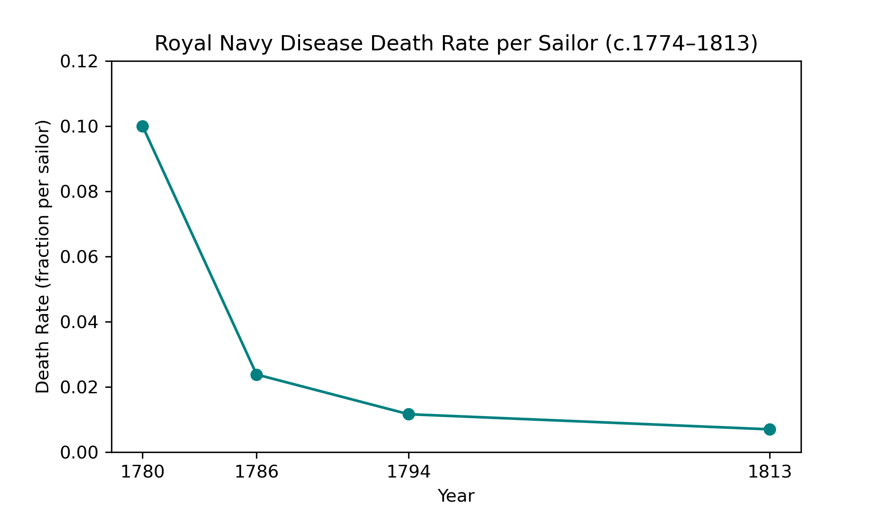
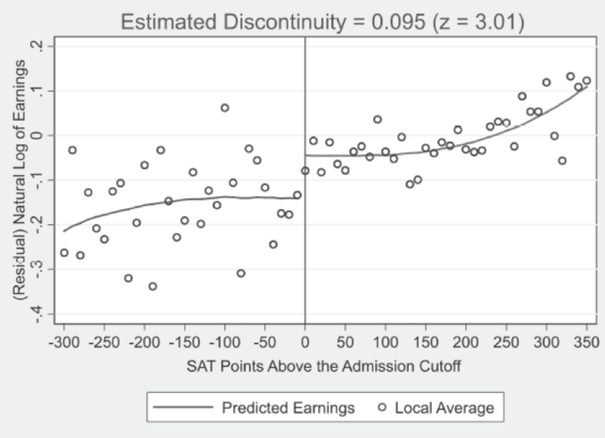
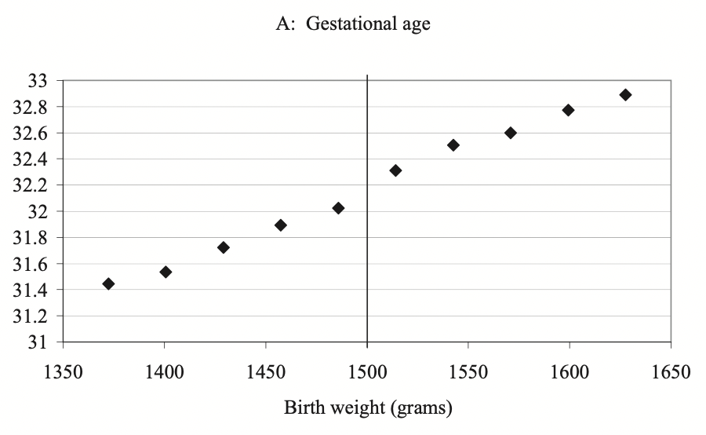
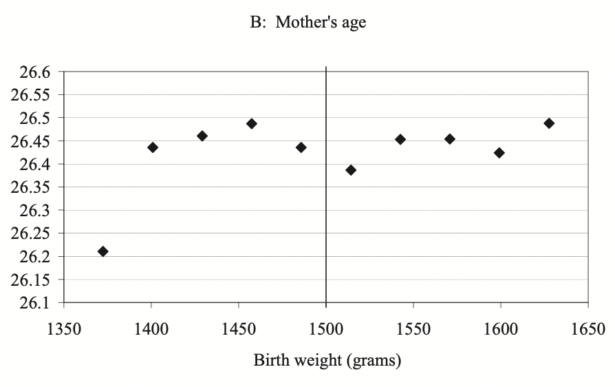
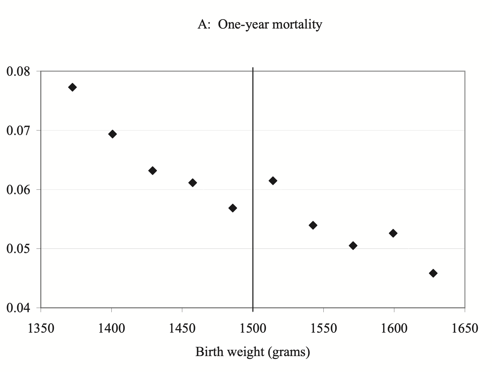
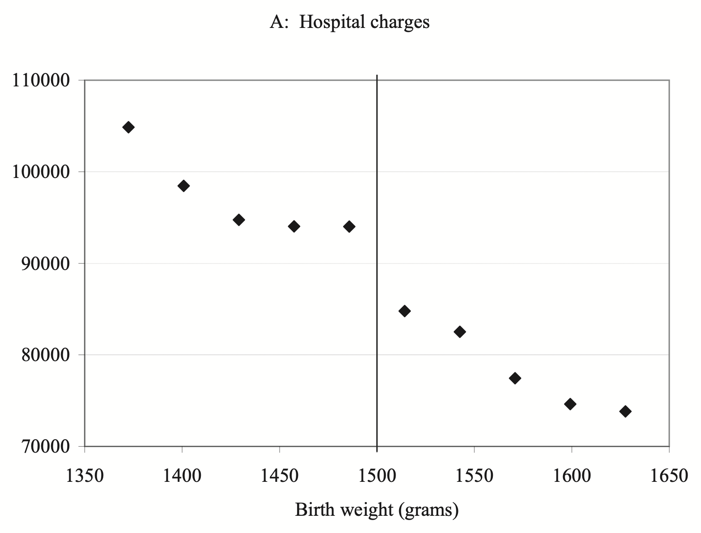
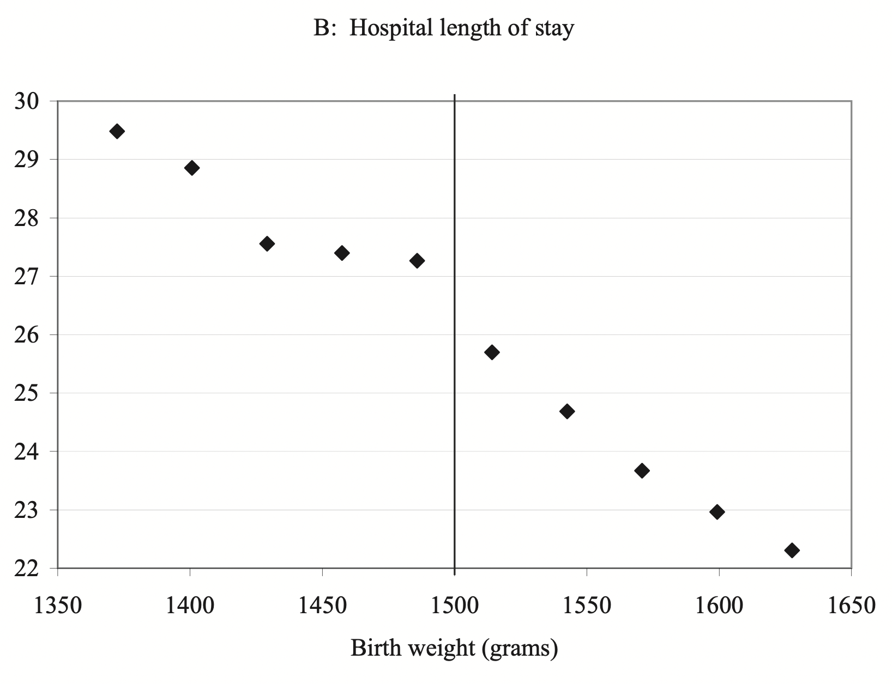
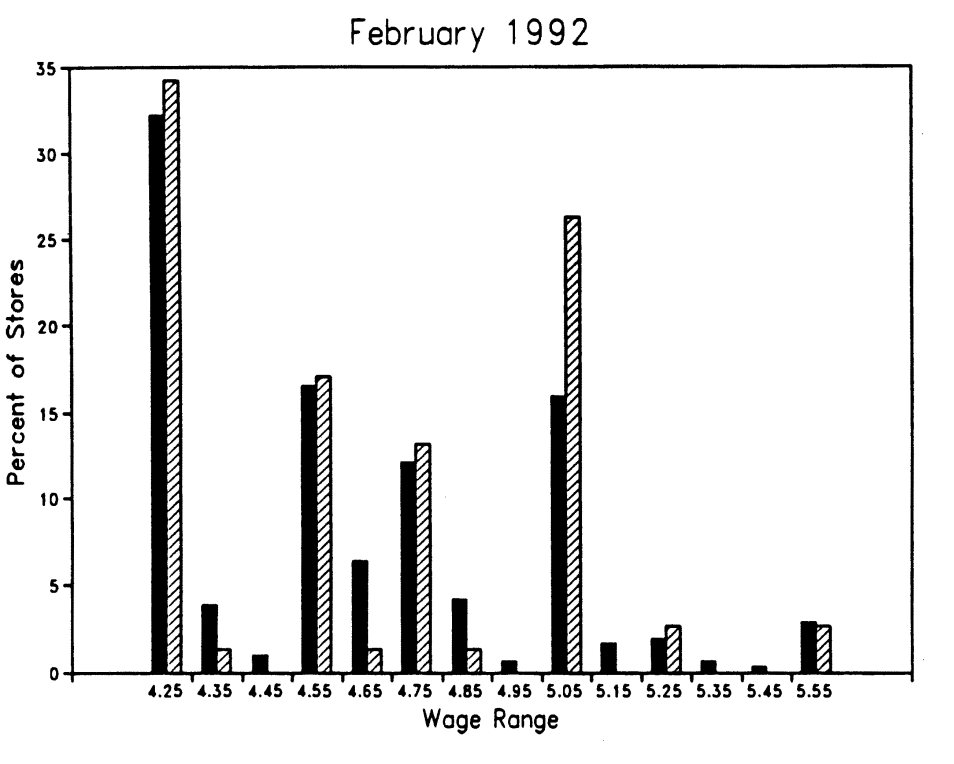
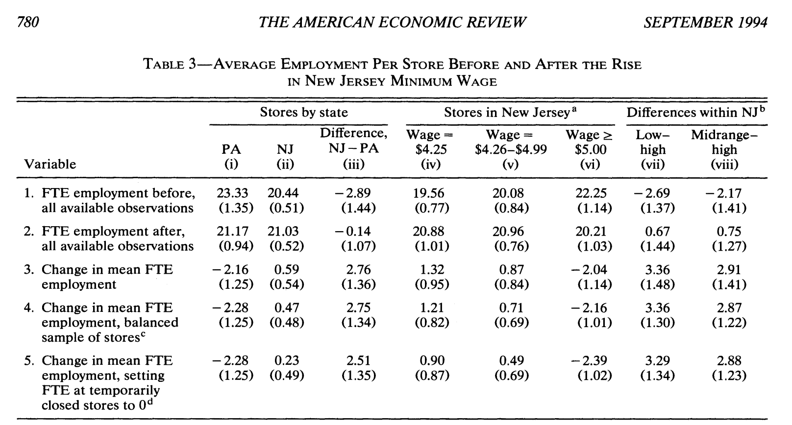
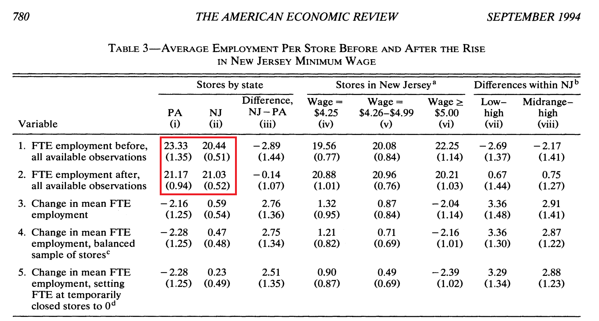

<style>
.caption {
  text-align: center;
  font-size: 14px;
}
</style>


<style>
.word-under { text-decoration: none; }
.def { display: none; }
/* step 2: underline the word */
.remark-slide-content.step2 .word-under { text-decoration: underline; }
/* step 3: keep underline and reveal the definition */
.remark-slide-content.step3 .word-under { text-decoration: underline; }
.remark-slide-content.step3 .def { display: block; }
</style>


<!--
.caption:before {
  content:"Figure: ";
  font-weight: bold;
} -->

```{r setup, include=FALSE}
options(htmltools.dir.version = FALSE)
library(reticulate)

# point reticulate to the exact Python you want
#py <- "/Users/eren/anaconda3/envs/r-reticulate/bin/python"
#Sys.setenv(RETICULATE_PYTHON = py)
#use_python(py, required = TRUE)

# make knitr use the same Python for python-engine chunks
#knitr::opts_chunk$set(engine.path = list(python = py))

#use_python("C:/Users/Eren/AppData/Local/r-miniconda/envs/r-reticulate/python.exe", required = TRUE)

# install once if needed (safe if already installed)
#try(py_install(c("pandas", "matplotlib", "seaborn"), pip = TRUE), silent = TRUE)

#py_config()   # sanity check in knit log
```

```{r,echo=F}
#library(countdown)
#countdown(minutes = 0, seconds = 10, top = 2,left = 5, right = 5)
```


<br><br>

**Historical overview**

The first known written record of an experiment was in... 
--
605 BCE.<br>

--
→ the Book of Daniel in the Hebrew Bible.

--

The Babylonian King wanted the Israelites to eat rich food and drink wine to get stronger. Daniel argued eating only vegetables and water was enough. He proposed that for 10 days, his group eats vegetables and water, others eat the king's diet.

--

At the end of 10 days, Daniel’s group looked healthier and stronger than those eating the royal food.

---

<br><br>

**Historical overview**

→ The first known medical experiment by James Lind in 1747. Scurvy emerged as one of the leading causes of death among sailors. The Royal Navy had no treatment, until James Lind proposed an experiment. He took 12 groups of sailors with scurvy. He gave them:

Cider<br>
Sulfuric acid <br>
Vinegar <br>
Sea water <br>
Garlic <br>
Oranges and lemon<br>

--

Did any of these treatments work?<br>
--

Yes, oranges and lemon worked. The sailors in that group were back on duty within a week.

--

From 1790s onwards, scurvy was virtually eliminated from the Royal Navy.

---
count: false

<br><br>

**Historical overview**

→ The first known medical experiment by James Lind in 1747. Scurvy emerged as one of the leading causes of death among sailors. The Royal Navy had no treatment, until James Lind proposed an experiment. He took 12 groups of sailors with scurvy. Results:




---

<br><br>

**Randomized Control Trial**

Today a modern experiment, or a "Randomized Control Trial" (RCT) looks like the following.

--

Take a group of participants. Randomly split them into treatment and control groups. Track and compare their outcomes at the end of the experiment. <br>

--
→This randomization gets rid of the "selection" problem.

--

What is the selection problem?: It is the bias that arises in group comparisons when individuals self-select into different groups.<br>
--
Eg., Does studying at Harvard improve your knowledge? Or are Harvard students more motivated to start with?<br>
--
→This is a testable research question. But is it feasible? What would an experiment look like?<br>
--
→Requires us to randomly pick high school seniors and have them attend Harvard (treatment), while have another group attend a state school (control). <br>
--
1- Harvard would not consent. <br>
2- There are ethical concerns too.<br>

--
→There are Institutional Review Boards (IRBs) at every university and college whose job is to review and approve/reject projects based on ethics.

---

<br><br>

**Stanford Prison Experiment (1971)**

One of the most controversial experiments, led by psychologist Philip Zimbardo at Stanford University.

24 college students were randomly assigned roles of prisoner or guard in a simulated prison in the basement of Stanford’s psychology building.

The goal was to study how power structures affect behavior.

--

The experiment escalated quickly:<br>
→ Guards became abusive, prisoners showed signs of emotional distress.


It was supposed to last 2 weeks, but was shut down after just 6 days.

→ Definitely not ethical since it led to psychological abuse.

---

<br><br>

**The Tuskegee Syphilis Study (1932–1972)**

One of the most unethical studies in U.S. history.

--

The U.S. Public Health Service studied 600 Black men in Alabama, 399 with syphilis, 201 without.

--

Those with syphilis were told they were receiving “free medical care,”  
but were never told they had syphilis.

Penicillin was the standard treatment since the 1940s, but doctors withheld treatment to observe the disease’s progression.

The study continued for 40 years, without <span class="word-under">informed consent</span>. 

--

class: step2
--
It was only exposed in 1972, after a whistleblower, Peter Buxtun, tipped the media.


In 1974, the U.S. Congress passed the National Research Act,  
which required all federally funded studies to go through IRBs.

--

→ Unfortunately there are other extremely unethical experiments in history: Nazi and Japanese human experiments (1940s), Willowbrook Hepatitis Study (1956–1970, New York). The subjects were never asked for their consent.


---

<style>
.font90 {
  font-size: 90%;
}
</style>


** Activity: Ethical or unethical?**

Suppose your team is the IRB at Dickinson. You received the following proposals. Would you reject or approve them? Describe why.

.font90[
*Meditation study*<br>
-Treatment: 10 minutes/day guided meditation for 2 weeks  
-Control: No change in routine  
-Outcome: Self evaluated daily stress scores

*Weight Loss study*<br>
-Treatment: Free smartwatch; asked to go to gym 3×/week  
-Control: No smartwatch or prompt  
-Outcome: Weight and mood tracked over 8 weeks

*Social Contact study*<br>
-Treatment: Asked to avoid all social contact for 24 hours  
-Control: No change in behavior  
-Outcome: Self-reported mood score

*Grocery Store Layout study*<br>
-Treatment: Move fruits/vegetables to front of store  
-Control: Standard store layout  
-Outcome: % of carts with 3+ produce items

*Fasting study*<br>
-Treatment: Fast for 12 hours before math test  
-Control: Eat normally
-Outcome: Performance on the test
]

```{r, echo=FALSE}
library(countdown)
countdown(minutes = 10, top = "50%", left = "65%")
```

---

<br><br>

**Examples of Modern RCTs in Social Sciences:**

Oregon Health Insurance Experiment (Finkelstein et al., 2012)

Angrist & Lavy (2009): Performance Incentives for Teachers and Students

Scott E Carrell, Mark Hoekstra, James E West (2011, Journal of Public Economics): "Is Poor Fitness Contagious? Evidence from Randomly Assigned Friends"

Gneezy & Rustichini (2000) – "A Fine is a Price"

Falk (2007) – Gift-Exchange with Real Firms

Bilen, Deniz and Bilen Eren (2025, Working Paper): "Collaborating with an Intelligent but Hallucinating Partner


---

<br><br>
**When experiments are infeasible**

→ there is a still a chance to analyze useful data with just observations.

--

Economists have been using "natural experiments" since 1990s. These are chance events that happen in real life that mimick an RCT.<br>
--
There are three main types of natural experiments:<br>
--
→Regression Discontinuity design<br>
→Instrumental Variable design<br>
→Differences in Differences design<br>

--

**Regression Discontinuity design** involves an arbitrary cutoff that decides on an outcome. Around the cutoff, the outcome is arguably random.

Eg, returns to college education: Hoekstra (2009), “The Effect of Attending the Flagship State University on Earnings: A Discontinuity-Based Approach”.<br>
→ Hoekstra received data from a public university that admitted students based on a hard SAT score and high school GPA cutoff. (1100 on the SAT, Math + Verbal) <br>
--
Arguably students just below and just above 1100 points are "similar". The cutoff, 1100 is arbitrary.


---

<br><br>
**Regression Discontinuity Design**

```{r,echo=F, out.width="80%",fig.align="center"}
knitr::include_graphics("rdd1.png")
```

---

<br><br>
**Regression Discontinuity Design**

<br>

```{r,echo=F, out.width="80%",fig.align="center"}

```

---

<br>
**Regression Discontinuity Design: Birth weight**

→ A baby is classified as very low birth weight if under 1,500gr at birth.<br>
--

(Not 1487, 1503gr etc. so 1,500 cutoff is somewhat arbitrary.)<br>
--

Once a baby receives this classification, hospitals have protocols to do additional procedures. Can answer: "Do additional procedures save lives?"

```{r,echo=F, out.width="80%",fig.align="center"}

```

---

<br>
**Regression Discontinuity Design: Birth weight**

→ A baby is classified as very low birth weight if under 1,500gr at birth.<br>
(Not 1487, 1503gr etc. so 1,500 cutoff is somewhat arbitrary.)<br>
Once a baby receives this classification, hospitals have protocols to do additional procedures. Can answer: "Do additional procedures save lives?"

```{r,echo=F, out.width="80%",fig.align="center"}

```


---

<br>
**Regression Discontinuity Design: Birth weight**

→ A baby is classified as very low birth weight if under 1,500gr at birth.<br>
(Not 1487, 1503gr etc. so 1,500 cutoff is somewhat arbitrary.)<br>
Once a baby receives this classification, hospitals have protocols to do additional procedures. Can answer: "Do additional procedures save lives?"

```{r,echo=F, out.width="80%",fig.align="center"}

```


---

<br>
**Regression Discontinuity Design: Birth weight**

→ A baby is classified as very low birth weight if under 1,500gr at birth.<br>
(Not 1487, 1503gr etc. so 1,500 cutoff is somewhat arbitrary.)<br>
Once a baby receives this classification, hospitals have protocols to do additional procedures. Can answer: "Do additional procedures save lives?"

```{r,echo=F, out.width="80%",fig.align="center"}

```


---

<br>
**Regression Discontinuity Design: Birth weight**

→ A baby is classified as very low birth weight if under 1,500gr at birth.<br>
(Not 1487, 1503gr etc. so 1,500 cutoff is somewhat arbitrary.)<br>
Once a baby receives this classification, hospitals have protocols to do additional procedures. Can answer: "Do additional procedures save lives?"

```{r,echo=F, out.width="80%",fig.align="center"}

```


---

<br><br>
**Instrumental Variable design**

Suppose you want to know if Walmarts cause people to gain weight. (not necessarily unhealthy, but more affordable + more options)

X: Whether there is a Walmart in your neighborhood (0-1 binary)<br>
Y: obesity rate in the neighborhood <br>

We can't just compare areas with and without Walmart because they can look very different. Walmart does not open its stores randomly. (location, population, income..)


---

<br><br><br>
**Instrumental Variable design**

```{r,echo=F, out.width="120%",fig.align="center"}

```

--

→ find an external force that only applies to your X variable (store openings) and not Y (except through X).


---

<br><br><br>
**Instrumental Variable design**

<iframe title="vimeo-player" 
        src="https://player.vimeo.com/video/502054333?h=54f95a86ce" 
        width="100%" height="60%" frameborder="0" 
        referrerpolicy="strict-origin-when-cross-origin" 
        allow="autoplay; fullscreen; picture-in-picture; clipboard-write; encrypted-media; web-share" 
        allowfullscreen
        style="margin-top:-1px; margin-left:2px;">
</iframe>

--

→ Z, the instrument, can be "distance to an existing Walmart". If you lived near Arkansas you arbitrarily had a higher likelihood of getting a Walmart in your town.


---

<br><br><br>
**Instrumental Variable design**

<iframe title="vimeo-player" 
        src="https://player.vimeo.com/video/502054333?h=54f95a86ce" 
        width="100%" height="60%" frameborder="0" 
        referrerpolicy="strict-origin-when-cross-origin" 
        allow="autoplay; fullscreen; picture-in-picture; clipboard-write; encrypted-media; web-share" 
        allowfullscreen
        style="margin-top:-1px; margin-left:2px;">
</iframe>

→ Courtemanche & Carden (2009, JUE) find that Walmarts actually reduced obesity, due to lower prices and broader access to food and non-food products eg, exercise items.

---

<br><br>
**Differences and Differences design**

→ Suppose you want to study the effects of minimum wage. Economic theory says it is expected to reduce employment. But does it?

What would an RCT for this look like? Is it ethical? 
--
No.

--

The only other option is to use a natural experiment:

Card & Krueger (1994, AER) used a minimum wage increase in New Jersey in April 1994 from $4.25 to $5.05, and compared fast-food employment in NJ (treatment) and PA (control) to estimate its impact.


→ This is called a Differences in differences design. In this case, you observe treated unit before and after the wage increase and the control unit before and after the wage increase (in NJ).


---

<br><br>
**Differences and Differences design**

<br><br>

<div style="display:flex; align-items:flex-start;">
  
  
</div>

---

<br><br>
**Differences and Differences design**


```{r,echo=F, out.width="100%",fig.align="center"}

```

---

<br><br>
**Differences and Differences design**


```{r,echo=F, out.width="100%",fig.align="center"}

```

--

.pull-left[
→ Take change in NJ - change in PA<br>
(21.03-20.44) - (21.17-23.33) = <br>
0.59 - (-2.16) = 2.76
]

--
.pull-right[
Why?: reduced turnover (cuts down training cost), higher morale which boosts sales etc.
]

---

<br><br>
**External validity**

⚠️In science, especially in social sciences, one study is almost never definitive.

Your findings are only applicable to your setting or sample. The extent to which your results are applicable to other settings is **external validity**.

Can you find groups in the population who are outside the scope of earlier studies we discussed?

---

<br><br>

** Activity: Determine the type of natural experiment**

Determine the type of natural experiment used in each study below. Explain why.

Angrist & Lavy (1999, QJE): Effect of class size on student achievement.<br>
Takes advantage of an institutional rule that requires a new class to be formed once enrollment exceeds 40 students in elementary and middle schools.

Oreopoulos (2006, AER): Compulsory schooling and lifetime earnings.<br>
Takes advantage of the 1947 U.K. reform that raised the minimum school-leaving age from 14 to 15.

Angrist (1990, AER): Military service in the Vietnam War and lifetime earnings.<br>
Takes advantage of the draft lottery rule where birthdates earlier in the calendar were given lower numbers and higher draft risk.

```{r, echo=FALSE}
library(countdown)
countdown(minutes = 10, top = "70%", left = "35%")
```


---

<br><br>

**Experiments in non-academic settings: A-B Testing**

The way companies such as Amazon, FB... decide on their website layouts.<br>
→ Show new design to a random group of users. You give consent by being on the webpage.

Tone of ChatGPT's responses: Prefer Option 1 or Option 2?

<br>


**Experiments in humanities:** <br>

Live performance vs. a recorded version. (Reason 2004, Theatre Journal)

Randomize line breaks in the same poem, ask whether readers rate it as more or less emotionally powerful. (Tsur 1998, Poetic Rhythm)

Art interpretation: Show participants abstract paintings with vs. without curator labels, then ask whether interpretation and reported enjoyment differ. (Hekkert & van Wieringen 1996, Empirical Studies of the Arts)

---

<br><br><br>

```{r,echo=F, out.width="55%",fig.align="center"}
knitr::include_graphics("thinking.png")
```

<div style="text-align: center;">
Questions..?

<br><br>


</div>


