<style>
.caption {
  text-align: center;
  font-size: 14px;
}
</style>


<style>
.word-under { text-decoration: none; }
.def { display: none; }
/* step 2: underline the word */
.remark-slide-content.step2 .word-under { text-decoration: underline; }
/* step 3: keep underline and reveal the definition */
.remark-slide-content.step3 .word-under { text-decoration: underline; }
.remark-slide-content.step3 .def { display: block; }
</style>


<!--
.caption:before {
  content:"Figure: ";
  font-weight: bold;
} -->

```{r setup, include=FALSE}
options(htmltools.dir.version = FALSE)
library(reticulate)

# point reticulate to the exact Python you want
#py <- "/Users/eren/anaconda3/envs/r-reticulate/bin/python"
#Sys.setenv(RETICULATE_PYTHON = py)
#use_python(py, required = TRUE)

# make knitr use the same Python for python-engine chunks
#knitr::opts_chunk$set(engine.path = list(python = py))

#use_python("C:/Users/Eren/AppData/Local/r-miniconda/envs/r-reticulate/python.exe", required = TRUE)

# install once if needed (safe if already installed)
#try(py_install(c("pandas", "matplotlib", "seaborn"), pip = TRUE), silent = TRUE)

#py_config()   # sanity check in knit log
```

```{r,echo=F}
#library(countdown)
#countdown(minutes = 0, seconds = 10, top = 2,left = 5, right = 5)
```


#  Boston Housing Data 🏠

Below is a portion of the **Boston** data set:
<br>

<table style="font-size: 14px; border-collapse: collapse; margin: auto;">
  <thead>
    <tr style="background-color:#f0f0f0;">
      <th>crim</th><th>zn</th><th>indus</th><th>chas</th><th>nox</th>
      <th>rm</th><th>age</th><th>dis</th><th>rad</th><th>tax</th>
      <th>ptratio</th><th>medv</th>
    </tr>
  </thead>
  <tbody style="text-align:center;">
    <tr><td>0.00632</td><td>18</td><td>2.31</td><td>0</td><td>0.538</td><td>6.575</td><td>65.2</td><td>4.0900</td><td>1</td><td>296</td><td>15.3</td><td>24.0</td></tr>
    <tr><td>0.02731</td><td>0</td><td>7.07</td><td>0</td><td>0.469</td><td>6.421</td><td>78.9</td><td>4.9671</td><td>2</td><td>242</td><td>17.8</td><td>21.6</td></tr>
    <tr><td>0.02729</td><td>0</td><td>7.07</td><td>0</td><td>0.469</td><td>7.185</td><td>61.1</td><td>4.9671</td><td>2</td><td>242</td><td>17.8</td><td>34.7</td></tr>
    <tr><td>0.03237</td><td>0</td><td>2.18</td><td>0</td><td>0.458</td><td>6.998</td><td>45.8</td><td>6.0622</td><td>3</td><td>222</td><td>18.7</td><td>33.4</td></tr>
    <tr><td>0.06905</td><td>0</td><td>2.18</td><td>0</td><td>0.458</td><td>7.147</td><td>54.2</td><td>6.0622</td><td>3</td><td>222</td><td>18.7</td><td>36.2</td></tr>
    <tr><td>0.02985</td><td>0</td><td>2.18</td><td>0</td><td>0.458</td><td>6.430</td><td>58.7</td><td>6.0622</td><td>3</td><td>222</td><td>18.7</td><td>28.7</td></tr>
  </tbody>
</table>

<br>

<div style="display:flex; align-items:flex-start; justify-content:center; gap:-10px;">

  <div style="flex:0 0 60%; font-size:12px; line-height:1.4; text-align:left;margin-top:-50px">
    <p><b>crim:</b> per capita crime rate by town.<br>
    <b>zn:</b> proportion of residential land zoned for lots over 25,000 sq.ft.<br>
    <b>indus:</b> proportion of non-retail business acres per town.<br>
    <b>chas:</b> Charles River dummy variable (=1 if tract bounds river; 0 otherwise).<br>
    <b>nox:</b> nitrogen oxides concentration (parts per 10 million).<br>
    <b>rm:</b> average number of rooms per dwelling.<br>
    <b>age:</b> proportion of owner-occupied units built prior to 1940.<br>
    <b>dis:</b> weighted mean of distances to five Boston employment centers.<br>
    <b>rad:</b> index of accessibility to radial highways.<br>
    <b>tax:</b> full-value property-tax rate per $10,000.<br>
    <b>ptratio:</b> pupil-teacher ratio by town.<br>
    <b>medv:</b> median value of owner-occupied homes in $1000s.</p>
  </div>

  <div style="flex:0 0 50%;">
    
  </div>

</div>


---
# Unsupervised learning vs Supervised learning

**Unsupervised learning:** find subgroups in the dataset  
- group towns that look *similar* in terms of ALL or some variables  
- searches patterns  
- it only has X variables, no Y variable  

<br>

**Supervised learning:** what are the variables that might impact house prices?  
How are they impacting house prices?  
- tries to estimate a “function” that maps X variable(s) to Y variable  
- can be used to explain a relationship (inference), or to predict the outcome of a given X.

General form of a function:
$$y = f(x)$$

---
#  The models 

Unsupervised  learning  models:
+ Clustering 
+ k-means
+ hierarchical clustering
+ Principal  Component  Analysis 
+ …
	
<br>

Supervised  learning  models:
+ Linear  regression
+ K-nearest  neighborhood  (KNN)
+ Support  Vector  Machines
+ Naïve  Bayes
+ Decision  Trees  (and  their  extensions)
+ Neural  Network
+ …

---
<br>
# Types of “fitting”

**Classification** refers to the type of supervised learning models  
with a binary response variable, for example:  

- Is this email a spam or not?  
- Is this patient diagnosed with cancer or not?  
- Does this picture include a cat or not?  

<br>

**Regression** refers to the type of supervised learning models  
with a continuous numeric response variable, for example:  

- Predicting house prices based on size and location.
- Estimating a student’s exam score from study hours.

---

<br>

#Activity: Classification or regression?

1. Predicting the bias score of a news article on a continuous scale (e.g., –1 = left, +1 = right).

2. Is a student’s essay written by a human or by AI?

3. Predicting whether a historical text was written by Author A.

4. Estimating the publication year of an anonymous document.

5. Estimating a movie’s Rotten Tomatoes score.

```{r, echo=FALSE}
library(countdown)
countdown(minutes = 5, top = "60%", left = "35%")
```


---

<br>
Recognize hand-written digits using the MNIST database:
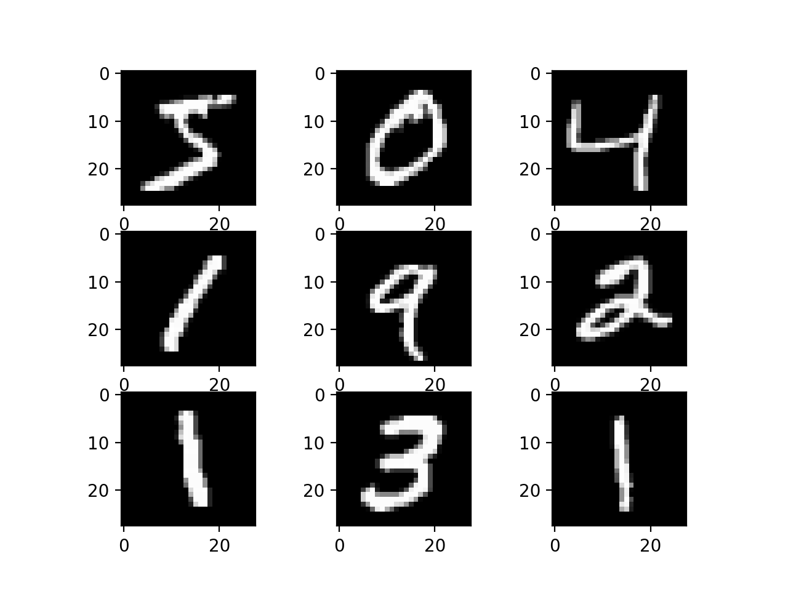

---

Predict the age of a person using their grocery store spending data?
.pull-left[]

<br><br>


<div style="margin-top:40px; margin-left:400px;">
Predict the age of a person from their picture?
</div>
.pull-right[]

---
# Why do we need models?

A simplified version:

<div style="display:flex; align-items:center; justify-content:center; gap:40px; margin-top:40px;">
  <div style="flex:1; text-align:center;">
    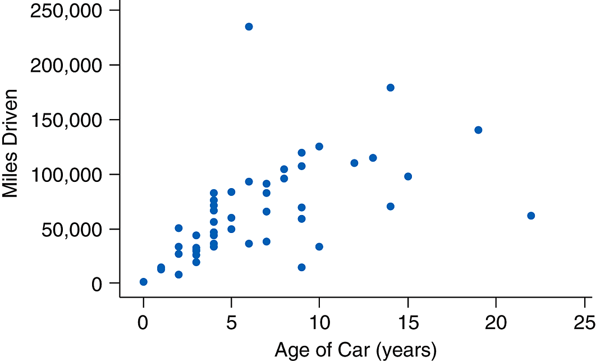
  </div>
  <div style="flex:1; text-align:center;">
    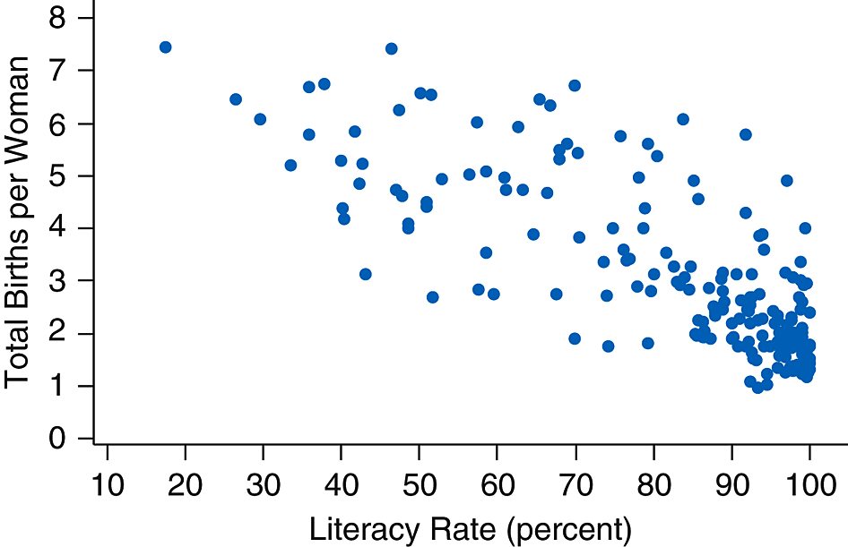
  </div>
</div>

---
# Why do we need models?

A simplified version:

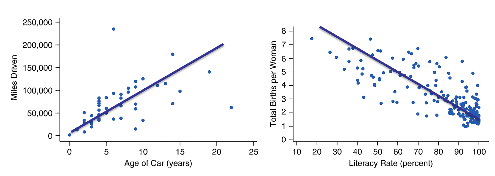


---
# Why do we need models?

A simplified version:


A model could be: <br>
Miles  Driven  =  10,000 $\times$ Age <br>
Number  of  births  =  8  –  10 $\times$ Literacy rate

---
# Terms to know

**Training** dataset: used to build and fit a model.  
The model “learns” patterns from this data by adjusting its parameters.

**Testing** dataset: used to evaluate the model’s performance  
on new data coming from the same population (different from the training set.)

**Prediction:** applying the trained model on the testing dataset  
or new data to estimate outcomes.

This whole process is known as Machine Learning.

Artificial Intelligence is a type of Machine Learning. Specifically: deep learning, or neural network.

Neural nets are simply more complicated f(x) functions.

---
# Activity: chess

Chess is a two player board game where each player's goal is to make the best moves in a given position.

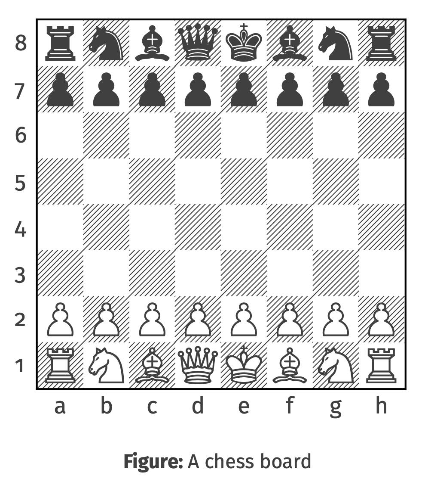

Can you think of what steps must be taken to train a model that can predict the likelihood of a player making a mistake (ie, playing a bad move) in a given position?

```{r, echo=FALSE}
library(countdown)
countdown(minutes = 10, top = "60%", left = "75%")
```

---

<br><br><br><br>

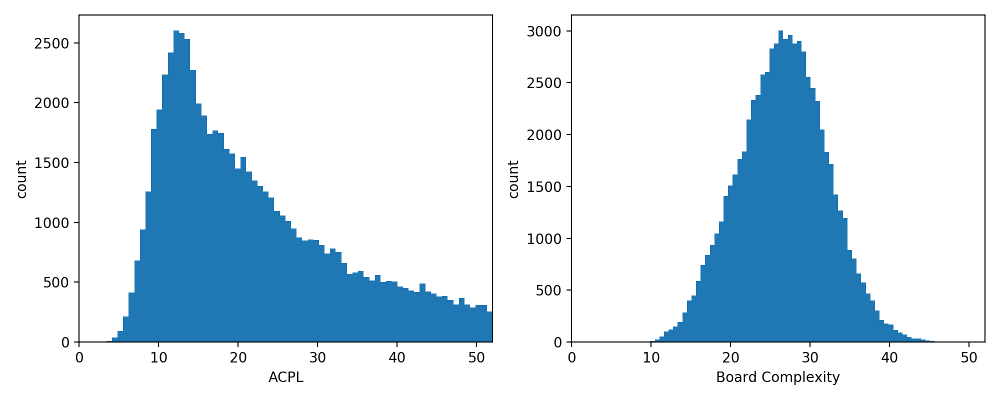

---
#  Linear regression 

Linear  regression  assumes  a  linear  relationship  between  the  predictors  and  the  response.

MilesDriven  =  b $\times$ Age ✅ <br>
MilesDriven  =  $2^{b \times Age}$

<br>


---
#  Linear regression 

Linear  regression  assumes  a  linear  relationship  between  the  predictors  and  the  response.

MilesDriven  =  b $\times$ Age ✅ 

A  linear  relationship  must  have  the  following  form:
y = a + bx
where  x  is  a  predictor,  and  y  is  the  response; a is the intercept, b is the slope.

<br>


---

#  Multilinear regression

You can use multiple x variables with a linear regression:

$y = b_0 + b_1 x_1  +  b_2 x_2  + …$

The  goal  of  linear  regression  is  to  calculate  $b_0 ,  b_1 ,  b_2 ,  …$  so  that  the  model  best  fits  the  training  set.

How  do  we  define  “fit”?

---

#  Model “fit” 

The  most  classical  way  to  decide  ”fit“  is  to  measure  how  big  of  a  “mistake”  the  model  made  on  the  training  set.

<div style="display: flex; justify-content: center; align-items: flex-start; gap: 30px; margin-top: -20px; margin-left:-50px">
  <div style="flex: 1; text-align: center;">
    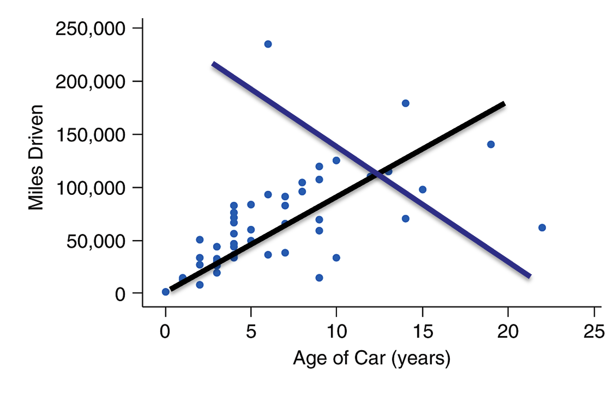
  </div>
  <div style="flex: 1; text-align: center;">
    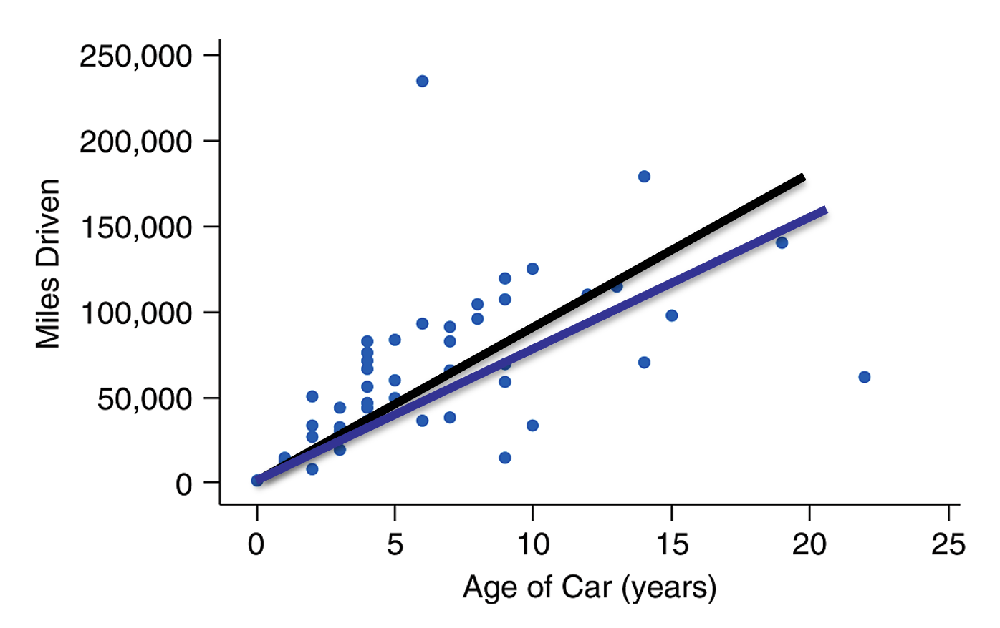
  </div>
</div>

---
#  Residuals

We need a more scientific approach. Notice the differences between what the model predicts and actual values, aka, residuals. For example: <br>

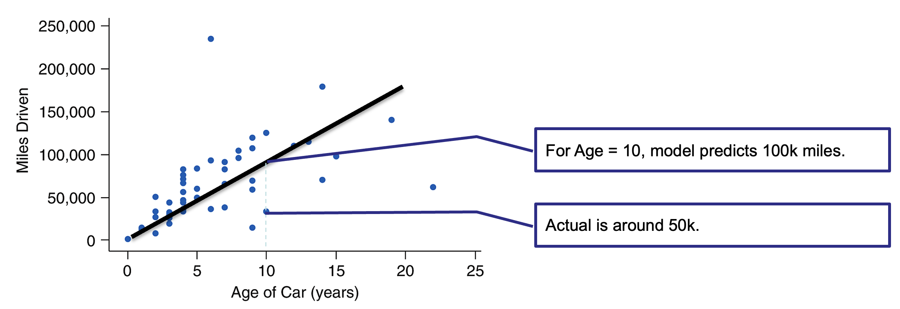


---
#  Residuals 

More generally:

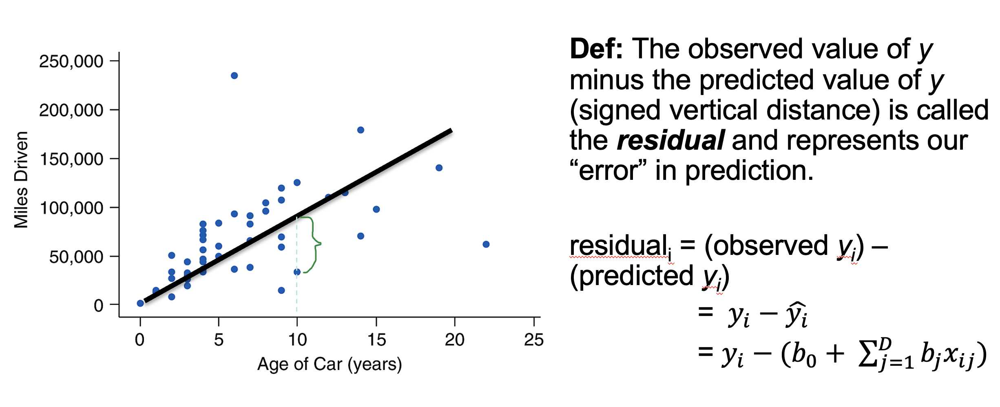

---
#  Residuals

The goal  is  to find a fit that  minimizes  the  sum  of  squared  residuals. This  is  called  the  Ordinary  Least  Squared  (OLS)  Method.

The  OLS  method  is  to  find the parameters,  $b_1,  b_2, …$  such  that  the  Sum  of  Squared  Residuals (SSR)  is  minimized:

$$ min \,\,\,SSR =  \sum_i^n{(y_i-\hat{y_i})^2} $$


---
#  Interpret linear regression results

Outcome variable: price of a car

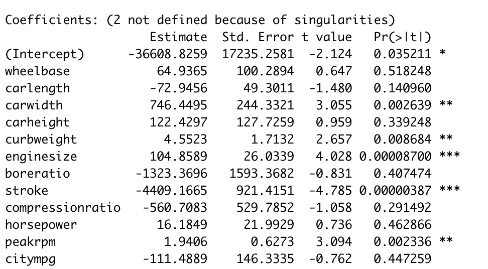
